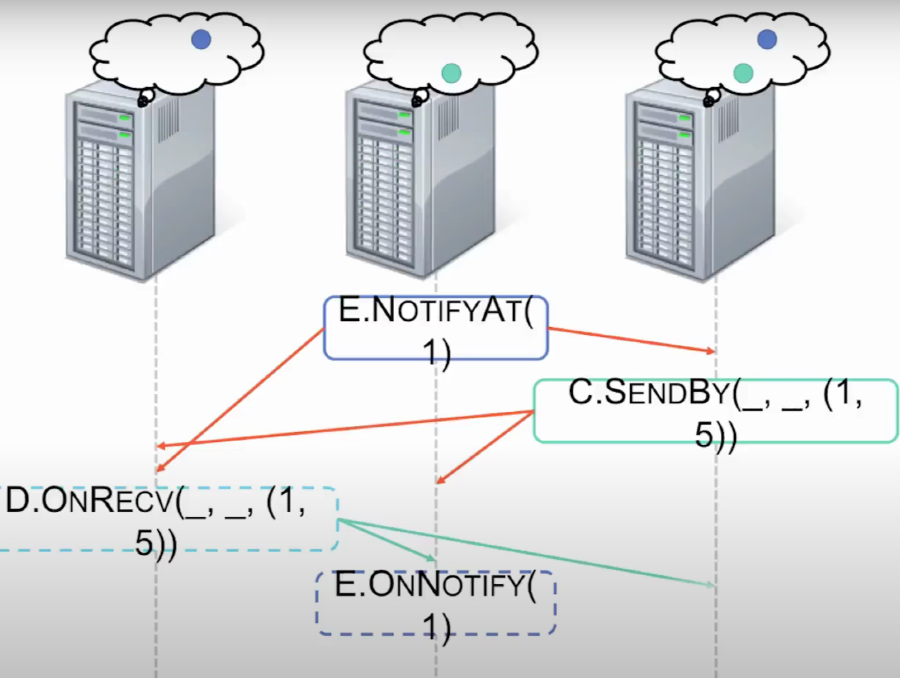
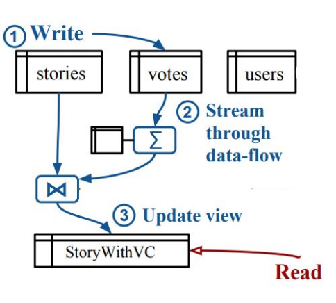

# Introduction
This week we talk about 3 different approaches for improving the performance
of an application
1. Naiad - A Timely Dataflow System.
2. Weld - End-to-End Optimization for Data Analytics 
   Applications.
3. Noria - Dynamic, partially-stateful data-flow 
   for high-performance web applications.

# Naiad

## Introduction
Naiad is a distributed system for executing data parallel, cyclic dataflow programs. It amalgamates features such as 
high throughput of batch processors, low latency of stream processors, and the ability to perform iterative and 
incremental computations.

## Motivation
Everytime a new Distributed Programming Model is introduced it is tightly coupled with the underlying execution model, 
viz., Batch Processing, Stream Processing, Graph Processing, and this has led to a proliferation in systems that 
struggle to interoperate with each other. For example, we have Batch Processing framework like MapReduce or Stream 
Processing Systems like storm or Graph Processing Systems like prego, and if one was to write a program that requires 
the use of two or more of these features they would end up using the lowest common denominator, i.e, Batch Processing, 
which would work fine for some workloads but not all. **Naiad** aims at resolving the complexities of combining these 
features in one framework.

## Approaches
Naiad proposes a new computational model, **timely dataflow**, that supports the following features:
1. structured loops allowing feedback in the dataflow,
2. stateful dataflow vertices capable of consuming and producing records without global coordination,
   and    
3. notifications for vertices once they have received all records for a given round of input or loop 
   iteration.

Together, the first two features are needed to execute iterative and incremental computations with low latency.
The third feature makes it possible to produce consistent results, at both outputs and intermediate stages of 
computations, in the presence of streaming or iteration.

### Timely Dataflow
With the use of Timely Dataflow, Naiad aims to raise the common denominator (addressed above) supporting all of
these different workloads. It is a computational model based on a directed graph in which stateful vertices send 
and receive logically timestamped messages along directed edges. This programming model is event based, so all 
execution for a vertex v happens in the context of a callback (v.OnCallBack(u,v)) and these vertices interact
with the outside world by performing operations (v.Operation(x,y,z)). We have 2 callbacks ,viz., 
v.ONRECV(e : Edge, m : Message, t : Timestamp) and v.ONNOTIFY(t : Timestamp), and 2 operations ,viz., 
this.SENDBY(e : Edge, m : Message, t : Timestamp) and this.NOTIFYAT(t : Timestamp). All message exchange in this
programming models are asynchronous. When a vertex is running it can send messages by invoking SENDBY with an
outgoing edge, a message, and a timestamp (which represents records that are associated with the same batch of data).
Every SENDBY results in a corresponding invocation of ONRECV. The sending on messages are asynchronous, so there is
no need of reordering of messages whiles sending (Like when data is streaming). However, there might be cases when we
need synchronization, i.e, receive all the data before doing the work (ex: result of an aggregate). For this, we use
NOTIFYAT and ONNOTIFY. This tells the vertex that it has received all the data until a given timestamp. Timely Dataflow
also supports loops, and each loop has three system provided vertices, viz., ingress, egress and feedback. The feedback
maintains a counter and explicitly distinguish different iterations, and  allow a system to track forward progress 
as messages circulate around the dataflow graph. 

### Progress Tracking Protocol - Achieving Timely Dataflow
Progress tracking ensures that the notifications (as described above) get delivered at the correct time and in a prompt
manner. To make this work, they have set a couple of ground rules. 
1. It expects the external source that feeds in data to give some context about the progress, i.e, they expect the data 
   to have an epoch label, and at some point declare the epoch is complete.
2. The Vertices can never send messages back in time. This means that if a Vertex receives callback ONRECV at time t, it
   can only SENBY at some time t' such that t' >= t.
   

The problem arises when we have loops, because the Vertex would depend on its own output. This is when the feedback loop
helps. As described above the feedback will increment the counter and make sure that we are forward progressing. In the
below example, E can ask to be Notified at time 1 and be sure to have received all messages until time 1.

The way they achieve Progress tracking is from above constraints. There is also a notion of Pointstamp, i.e, at a time
t the message can either live on the edge or the vertex. Thus, the Pointstamp of SendBy could be (t, e) and Pointstamp
of a NotifyAt would be (t, v). Also, a Pointstamp(t1, l1) could-result-in Pointstamp(t2, l2) If there is a path between 
l1 and l2 presented by f(), i.e. f(t1) <= t2. Putting in simple terms:
1. Scheduler has active Pointstamps <-> unprocessed events. It also has two counts, viz., Occurrence count of not 
   resolved events, and a Precursor count of how many active Pointstamps precede it in the could-result-in order.
2. Sort events by could-result-in order.
3. Deliver notifications to the frontier set.

### Distributed implementation of Naiad

Naiad cluster is a group of processes hosting workers that manage a partition of the timely dataflow vertices. Workers 
exchange messages locally using shared memory, and remotely using TCP connections between each pair of processes. Each 
process participates in a distributed progress tracking protocol, in order to coordinate the delivery of notifications.
1. Data parallelism - A program specifies its timely dataflow graph as a logical graph of stages linked by typed 
   connectors. At execution time, Naiad expands the logical graph into a physical graph where each stage is replaced 
   by a set of vertices and each connector by a set of edges.
2. Workers - Each Naiad worker is responsible for delivering messages and notifications to vertices in its partition of
   the timely dataflow graph. When faced with multiple runnable actions (messages and notifications to deliver) workers 
   break ties by delivering messages before notifications, in order to reduce the amount of queued data.
3.  Distributed progress tracking - Similar to above, but each worker maintains a local frontier and broadcasts 
    (to all workers, including itself) progress updates. This protocol has an important safety property: no local 
    frontier ever moves ahead of the global frontier, taken across all outstanding events in the system. A naive 
    implementation of the protocol would broadcast every progress update and result in impractical communication demands
    and thus the paper addresses a couple of optimizations on top of it.
    

## Trade-Offs
One of the weakest part of the paper is Fault tolerance and availability. Naiad uses a Checkpoint and Restore mechanism 
in case of any failure (for the detailed implementation, please refer to the paper). 
In order to maintain the touted low latency, Naiad does not offer a fast parallel recovery, unlike Spark's DStream.

## Open Questions and Future Work
There has been a cleverer Fault tolerance scheme developed after this paper on Naiad where some vertices' checkpoint, 
while others log messages. To read more about it, here's the paper on [Falkirk Wheel](https://arxiv.org/pdf/1503.08877.pdf).
The researchers of Naiad are also investigating the use of RDMA over InfiniBand, which has the potential to reduce 
micro-stragglers (refer to the paper to know more about the effects of micro-stragglers) using mechanisms such as 
microsecond message latency, reliable multicast, and user-space access to message buffers. These mechanisms will avoid 
TCP-related timers in the operating system.

# Weld

## Introduction
Weld is a common runtime for existing data analytics libraries that performs key physical optimizations such as 
pipelining under existing, imperative library APIs.

## Motivation
Modern data analytics applications combine many disjoint processing libraries and functions. For example, if you
consider the Python ecosystem, a typical datascience application may load some data using pandas, or do some
preprocessing using NumPy. This is good, because a user can get the best results by leveraging these libraries developed
by skilled authors, but the user does not get any optimization across the individual optimized functions, i.e,  these 
independent software libraries lack one of the main benefits of a DBMS: end-to-end optimization. Hence, we have **Weld**, a 
common runtime for data analytics libraries that can perform key physical optimizations under diverse existing libraries.

## Approaches
Weld lets libraries express the data-parallel structure of their computations (e.g., a map operation or an aggregation) 
using a functional intermediate representation (IR), and uses a lazily evaluated runtime API to collect IR code from 
different libraries.

### Weld IR
The first component in Weld is its intermediate representation (IR), a language that libraries use to describe their 
computations. The key idea is to provide a parallel loop operator that can read one or more collections of data and 
updates one or more declarative builders to produce results, such as computing a sum or constructing a hash table.
There are a couple of constraints on the IR:
1. IR is purely functional, meaning variables are immutable once assigned, and
2. Virtual function calls are disallowed.
These constraints exist to make the IR amenable to analysis and optimization.

Weld has multiple abstraction for constructing results called builders. Below are the types of builders supported by Weld.

As an example, a vecbuilder takes values of type T and builds a vector of merged values, and a merger T,op combines
values of type T into a single result using an associative operation op.

The explicit separation of loops and builders also makes it possible to update multiple builders in a single loop. 
For example, suppose that an application wants to compute two results based on a sequence of numbers. In the
Weld IR, it is possible to write a single loop over the data that produces both results in two different builders.

There are also extensions to the IR to support strided access to the data, for example, NumPy may just need the access
to just one column in a matrix.

### Weld Runtime API
Weld’s second major component is its runtime API, and unlike interfaces like OpenCL and CUDA, Weld’s API is lazily 
evaluated, so, as libraries call the API and submit fragments of IR code, Weld remembers the fragments and only executes
them when a special function is called to force evaluation. This creates the opportunity to run optimizer, such as a 
single loop for iterating over the same data for two different results.
Developers integrate Weld into their libraries using an interface called WeldObject, which represents either a lazily 
evaluated sub computation or some in-memory data in the application. The "Evaluate" call evaluates a WeldObject instance 
and returns a result.

There a couple of extensions on the API to better support larger applications:

1. Grouped Evaluation - Enables executing multiple Weld objects in a single computation rather than one computation 
   for one object.

2. Memory Management Functions - Gives library access to control the amount of memory Weld consumes. This is useful
   in engines that already perform their own memory management, such as Spark SQL: these engines can call Weld-optimized
   code on batches of data and spill to disk when they grow past a certain size.
   
In nut-shell, the life of a Weld program would look something like:

   

## Trade-Offs
Libraries are ever evolving. New features keep on patching-in and there are even new libraries coming up. As per my
understanding, Weld would also have to update itself to support these new features or upcoming libraries. Moreover, a
developer wanting to use Weld would have to understand the data structure that Weld deals with (mentioned above). There 
will be a slight learning curve before one can start integrating Weld.

## Open Questions and Future Work
How would Weld keep-up with the evolving environment? Looks like, most of the Weld developers have graduated or are 
currently busy with other projects.

# Noria

## Introduction
Noria introduces a partially-stateful data-flow, that aims at simplifying the backend infrastructure for read-heavy web 
applications while improving their performance.

## Motivation
Web applications generally use a relational database to store and query data and are read-heavy. As cited in the paper,
across one month of traffic data from a HotCRP site and the production deployment of Lobsters, 88% to 97% of queries
were reads (SELECT queries), and these reads consumed 88% of total query execution time in HotCRP. Since read performance
is important, application developers often manually optimize it, by either in-memory key-value cache (like Redis) or by
stream-processing systems. This is where Noria comes into the picture, it combines the best of these worlds.

## Approaches
Noria has a notion of base tables and derived views. Roughly, base tables contain the data typically stored persistently, 
and derived views hold data an application might choose to cache. Applications interact with Noria via an interface that
resembles parameterized SQL queries. The application supplies a Noria program, which registers base tables and views 
with parameters (ex: WHERE stories.id = "?"; ? is the parameter) supplied by the application when it retrieves data.

Noria introduces three innovations:

1. A partially stateful dataflow model.
2. Automatic merge and reuse of data-flow subgraphs 
   over multiple queries
3. Fast, dynamic transitions for data-flow graphs in the
   presence of new queries and schema changes
   
### Dataflow Design
Noria’s data-flow is a directed acyclic graph of relational operators such as aggregations, joins, and filters. Here
are the key take-aways from their DataFlow design:

1. Roots of the DAG are base tables
2. External views are at the leaves.
3. Internal views are represented by relational operators.
4. Updates are first applied to the base table and then propagate through the data-flow graph as deltas.
5. Join operators use an upquery to process updates - better than just keeping windowed state.
6. Some operators (e.g. projection, filter) are stateless, while some (e.g. count, min/max) are stateful to avoid
redundant re-computation.
   

An efficient Noria design faces two key challenges:
1. It must limit the size of its state and views, and 
2. Changes to the Noria program must adapt the dataflow without downtime in serving clients.

### Partially-stateful data-flow
The partially-stateful data-flow model lets operators maintain only a subset of their state. Partial state is based 
around partially materialised views in databases which allow operators to only contain a subset of their overall state. 
Partial state reduces memory use, allows eviction of rarely used state, and relieves operators from maintaining state
that is never read. To achieve this, Noria introduces a new dataflow message: eviction notices. Eviction notices flow 
forward along the update dataflow path; they indicate that some state entries will no longer be updated. Whenever Noria 
needs to read from evicted state it re-computes that state. This process sends recursive upqueries to the
relevant ancestors in the graph. It starts off with an empty state, lazily issue upqueries and fills the empty state.

### Dynamic data-flow
Application queries evolve over time, so Noria’s dynamic data-flow represents a continuously-changing set of SQL 
expressions. Given new or removed expressions, Noria transitions the data-flow to reflect the changes. First stage of 
dataflow transitions is to plan what needs to be added to the dataflow graph, share and reusing operators wherever 
possible. The key challenges for transitions are to avoid unnecessary state duplication and to continue processing reads
and writes throughout. 

To plan a transition, Noria:
1. Translates each new expression into an extended query graph.
2. Uses query graphs to quickly establish a set of sharing candidates for each new expression.
3. Generates a verbose intermediate representation (IR). This simplifies common subexpression detection, 
   and allows Noria to efficiently merge the new IR with the cached IR of the sharing candidates. The combined final IRs
   of all current expressions represent the transition’s target data-flow.
4. Adds any operator in the final IR that does not already exist in the data-flow.

## Trade-Offs
As cited in the paper:
1. The current prototype only guarantees eventual consistency; its eviction from partial state is randomized; 
   it is inefficient for sharded queries that require shuffles in the data-flow.
2. It lacks support for some SQL keywords.
3. Noria’s current design primarily targets relational operators, rather than the iterative or graph computations that 
   are the focus of other data-flow systems, and processes structured records in tabular form.
4. The current implementation only shards by hash partitioning on a single column, and resharding requires sending 
   updates through a single instance, which limits scalability.
5. The current implementation does not currently support range indices or multi-column joins.
6. The current implementation re-computes data-flow state on failure.

## Open Questions and Future Work
1. Recovering from  snapshots or data-flow replicas would be more efficient (e.g., using selective rollback; citing back 
   to [Falkirk Wheel](https://arxiv.org/pdf/1503.08877.pdf)).
2. It mentions in the paper, "application’s working set in these views should fit in memory for good performance". If for
   some reason the application starts to hog memory, what happens to Noria? Does the performance degrade drastically or
   it would be able to manage by eviction?
