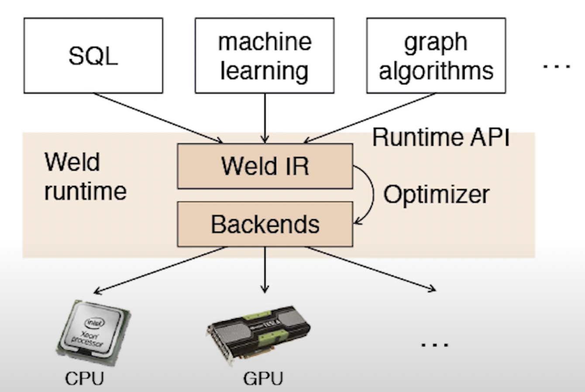
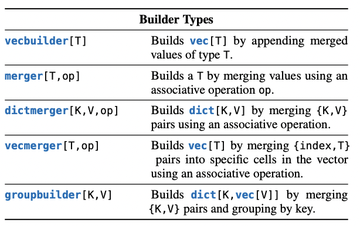
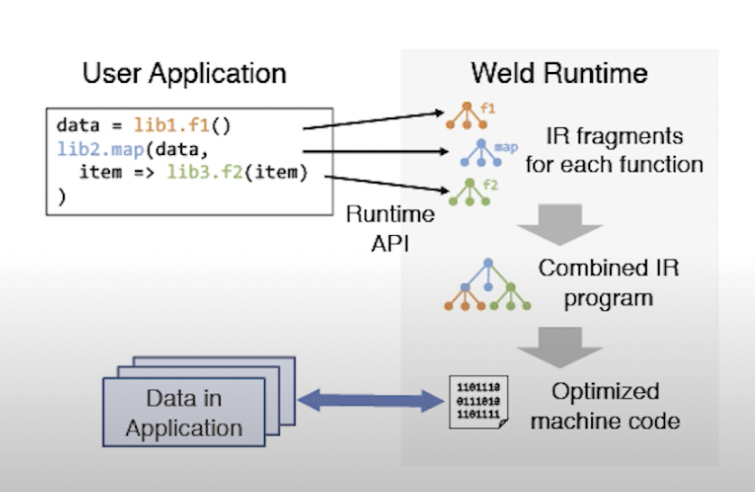
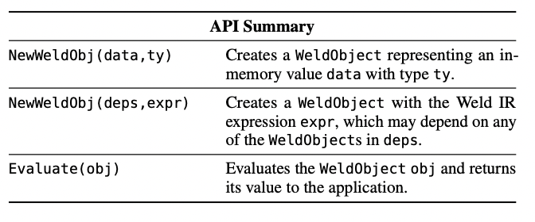

# Introduction
A brief look into Programming Models:
* Naiad: A Timely Dataflow System
* Weld: Evaluating End-to-End Optimization for Data Analytics Applications
* Noria: Dynamic, partially-stateful data-flow for high-performance web applications

# Naiad: A Timely Dataflow System

## Introduction
Naiad is a distributed system for executing data parallel, cyclic dataflow programs. It offers the high throughput
of batch processors, the low latency of stream processors, and the ability to perform iterative and incremental
computations in a single framework. A new computational model, ***timely dataflow***, with timestamps that represent
logical points in the computation, underlies Naiad and captures opportunities for parallelism across a wide class of algorithms. 

## Motivation
Many data processing tasks require low-latency interactive access to results, iterative sub-computations, and
consistent intermediate outputs so that sub-computations can be nested and composed (Example: Iterative Machine Learning algorithms). However, no existing system satisfies all these requirements in a single sysytem under one hood. 
For example: 
1. Stream processors can produce low-latency results for non-iterative algorithms, 
2. Batch systems can iterate synchronously at the expense of latency.
3. Trigger-based approaches support iteration with only weak consistency guarantees. 

  

An applications built on a single platform with these features is typically more efficient, succinct, and maintainable. Naiad aims to fill this void with a general-purpose system that fulfills all of these requirements and supports a wide variety of high-level programming models. 

## Approaches

Timely Dataflow supports directed dataflow graphs with structured cycles, analogous to structured loops in a standard imperative programming language. This structure provides information about where records might possibly flow in the computation, allowing an implementation like Naiad to efficiently track and inform dataflow vertices about the possibility of additional records arriving at given streaming epochs or iterations.

Naiad developed a new computational model as mentioned above, timely dataflow, that supports the following features:
1. Structured loops allowing feedback in the dataflow. 
2. Stateful dataflow vertices capable of consuming and producing records without global coordination.

***(The above two features are needed to execute iterative and incremental computations with low latency.)***

3. Notifications for vertices once they have received all records for a given round of input or loop iteration.

***(This feature makes it possible to produce consistent results, at both outputs and intermediate stages of computations, in the presence of streaming or iteration.)***

***Terminologies:***

***Timely dataflow:*** Computational model based on a directed graph in which stateful vertices send and receive
logically timestamped messages along directed edges. Has cycles along with timestamps to distinguish data that arise in different input epochs and loop iterations.

***Input vertice:** Each input vertice receives a sequence of messages from an external producer.

***Output vertice:*** Each output emits a sequence of messages back to an external consumer. Each output message is labeled with its epoch.

***Loop contexts:*** Timestamp ordering with epochs and loop iterations is achieved using Inegress, Egress, and feedback vertices.

***Flow:***
The model supports both asynchronous and fine grained synchronous events execution.
Messages in a timely dataflow system flow only along edges, and their timestamps are modified by ingress, egress, and feedback vertices. All events and messages are asynchronous.

Vertices send and receive timestamped messages, and may request and receive notification that they have received all messages bearing a specific timestamp using two callbacks v.ONRECV(e : Edge, m : Message, t : Timestamp) and v.ONNOTIFY(t : Timestamp).

A vertex may invoke two system-provided methods in the context of these callbacks: this.SENDBY(e : Edge, m : Message, t : Timestamp) and this.NOTIFYAT(t : Timestamp).

Each call to u.SENDBY(e,m,t) results in a corresponding invocation of v.ONRECV(e,m,t), where e is an edge from u to v, and each call to v.NOTIFYAT(t) results in a corresponding invocation of v.ONNOTIFY(t).

The ONRECV and ONNOTIFY methods may contain arbitrary code and modify arbitrary per-vertex state, but do have an important constraint on their execution: when invoked with a timestamp t, the methods may only call
SENDBY or NOTIFYAT with timestamp t′ ≥ t. This rule guarantees that messages are not sent “backwards in time”.

SendBy and NotifyAt are API calls available to a data-flow vertex implementation to emit output records (SendBy) and to tell the runtime system that the vertex would like to receive a callback at a certain time (NotifyAt). It's the runtime system's job to figure, using the progress tracking protocol, when it is appropriate to invoke NotifyAt.

Fine grained synchronous events execution uses ONNOTIFY(t) calls to perform aggregations at timestamp t. 

To handle consistency of inside loop iterations and the timestamps of notifications, Naiad uses ***Progress Tracking Protocol.***(refer paper for details).

 ***Distributed implementation:*** 

 

Schematic architecture of a Naiad cluster: a group of processes hosting workers that manage a partition of the timely
dataflow vertices. Workers exchange messages locally using shared memory, and remotely using TCP connections between each pair of processes. Each process participates in a distributed progress tracking protocol, in order to coordinate the delivery of notifications.
Naiad relies on data parallelism to increase the aggregate computation, memory, and bandwidth available to applications. A program specifies its timely dataflow graph as a logical graph of stages linked by typed connectors. Each connector optionally has a partitioning function to control the exchange of data between stages. At execution time, Naiad expands the logical graph into a physical graph where each stage is replaced by a set of vertices and each connector by a set of edges.
Each Naiad worker is responsible for delivering messages and notifications to vertices in its partition of the timely dataflow graph. When faced with multiple runnable actions (messages and notifications to deliver) workers break ties by delivering messages before notifications, in order to reduce the amount of queued data.

We can conclude that Naiad’s performance makes it a powerful general-purpose programming platform and model for both batch and streaming computation. The biggest advantage of using Naiad is to be able to decouple the execution engine with the distributed systems protocol.

## Tradeoffs 
Practical challenges arise when supporting applications that demand a mix of high-throughput and lowlatency computation like coordinating distributed processes with low overhead, and engineering the system to avoid stalls—from diverse sources such as lock contention, dropped packets, and garbage collection—that disproportionately affect computations that coordinate frequently.

Fault tolerance: Using rollback and checkpoint. Current design favors performance in the common case
that there are no failures, at the expense of availability in the event of a failure

Updating large amounts of shared states, uses approximate states. Requires reliable network and overhead of sending these messages. 

Doesn't provide solutions to stragglers and load balancing across the workers.

Checkpointing stops the data processing and computations. The only other alternative is to implement logging but that would significantly increase the disk I/O.

Faces challenges handling larger size of states due to runtime overheads and intervenes with the recovery mechanism, ie. 
checkpointing. 

Use of TCP might provide reliablilty but the bursty pattern of messages can lead to micro-stragglers
and adversely affect latencies.

Timely dataflow is in a bit of a weird space between language library and runtime system.(Ex: It doesn't quite have the stability guarantees a library might have (when you call data.sort() you don't think about "what if it fails?"))

***Paper Link:***
https://cs.nyu.edu/~apanda/classes/sp21/papers/naiad.pdf

## Open Questions and Future Work
Provide a robust fault tolerance system. Maybe use of a dynamic recovery mechanism at runtime, which can switch between logging and checkpointing.

Handling large states and recoveries, deal with checkpoint latencies and data processing stopping. 

On going work on investigating the use of RDMA, which has the potential to reduce micro-stragglers due to TCP.
Naiad, still uses a mark-and-sweep garbage collector (GC) to reclaim memory instead of copy collection. It also kind of bends around to reduce GC calls to maintain low latency levels.

C# was chosen as a memory-safe language, made development easier but they actually had to do a fair amount of optimization work to address performance problems with C# on the critical data processing path (example: garbage collection). (Note: It was re-implemented in Rust).

There is no architectural reason why Naiad would ever be slower than Spark. However, Spark perhaps has a better story on interactive queries. In Spark, they can use existing, cached in-memory RDDs, while Naiad would require the user to recompile the program and run it again. Spark is also quite well-integrated with the Hadoop ecosystem and other systems that people already use (ex: Python statistics libraries, cluster managers like YARN and Mesos), while Naiad is largely a standalone system.

# Weld

## Introduction

Weld is a common runtime for existing data analytics libraries that performs key physical optimizations such as pipelining under existing, imperative library APIs. Weld optimizer eliminates multiple forms of overhead that arise when
composing imperative libraries like Pandas and NumPy, and uses lightweight measurements to make data-dependent decisions at runtime in ad-hoc workload, with sub-second overhead.

## Motivation

Modern analytics applications combine multiple functions from different libraries and frameworks to build increasingly complex workflows. Even though each function may achieve high performance in isolation, the performance of the combined workflow is often an order of magnitude below hardware limits due to extensive data movement across the functions. To address this problem, Weld proposes, a runtime for data-intensive applications that optimizes across disjoint libraries and functions. Weld uses a common intermediate representation (IR) to capture the structure of diverse data-parallel workloads, including SQL, machine learning and graph analytics. It then performs key data movement optimizations and generates efficient parallel code for the whole workflow. Weld can be integrated incrementally into existing frameworks like TensorFlow, Apache Spark, NumPy and Pandas without changing their user-facing APIs. 

 

 ## Approaches

  

**Weld IR**

  

IR code submitted to Weld is combined, optimized via rules, and transformed to generate adaptive optimization code for decisions based on runtime statistics. The optimized IR code is compiled to assembly using LLVM.

The first component in Weld is its intermediate representation(IR), a language that libraries use to describe their computations.

The key idea is to provide a parallel loop operator that can read one or more collections of data and updates one or more declarative builders to produce results, such as computing a sum or constructing hash table.

Weld imposes a number of constraints on the IR to make it amenable to analysis and optimization: the IR is purely functional, meaning variables are immutable once assigned, and virtual function calls are disallowed.

***Data Types***
Weld’s basic data types are scalars (e.g., int, float), structures (denoted {T1,T2,...}), variable-length vectors (vec[T]),
and dictionaries (dict[K,V]) because they commonly appear in data analytics.

***Computation***
Weld’s IR contains sequential operators for arithmetic, dictionary lookups, indexed lookups on vectors, sequential
while loops, sorting, and calling external C functions. In addition, the IR has two parallel constructs: a parallel for loop and an abstraction for constructing results called builders.

Supported Builders:

  

Builders support three basic operations. 
1. The ***merge(b, v)*** operation adds a new value v into the builder b and returns a new builder object to represent the result. 
2. The ***result(b)*** operator destroys the builder b and returns its final result: no further operations are allowed on it after this. 
3. The ***for loop*** operator updates one or more builders in parallel.

Some restrictions are places on builders like each builder must be consumed exactly once per control path to prevent having multiple values derive from the same builder, which would require copying its state and functions passed to for must return builders derived from their arguments. These restrictions allow Weld to safely implement builders using mutable state.

*** Weld IR Extensions:** To better support more workloads, Weld IR presentsa more general concept of loops. Example: NumPy require strided access over part of an array and also many operations require iterating over multiple collections together, an example, many Pandas functions require operating over two separate data columns in a DataFrame.
The for loop construct is extended to accept multiple iterators as input, where an iterator is defined as a vector of data, a start index, an end index, and a stride.

**Weld Runtime API**
 

Weld’s second major component is its runtime API. Weld’s API is lazily evaluated.
For ex: With Weld’s API, the filtering and aggregation computations are submitted lazily, and Weld’s optimizer will fuse and vectorize them together for enhanced performance to just compute the final result sum.

Developers integrate Weld into their libraries using an interface called WeldObject, which represents either a lazily evaluated subcomputation or some in-memory data in the application (e.g., a NumPy array). 
A WeldObject may depend on other WeldObjects (possibly from other libraries), forming a DAG for the whole program where leaf nodes in the DAG refer to in-memory data.

 **The main API functions for manipulating WeldObjects:**

 

 **Runtime API Extensions:**
 Weld developed two API extensions to support larger applications:

**Grouped Evaluation:** Evaluate is updated to allow evaluating multiple Weld objects in one computation, which is useful in applications that produce multiple result.

**Memory Management Functions:** Added functions allowing libraries to control Weld’s memory usage. Libraries can set a cap
on how much memory a call to Evaluate may use, and the call will fail if it needs to allocate more memory at runtime. This is useful in engines that already perform their own memory management.

***AN OPTIMIZER FOR WELD***
Weld needs to identify and eliminate many forms of redundancy that arise from imperative data analytics libraries. This challenge was addressed by performing a wide range of redundancy elimination transformations from the database and compiler literature (ex: pipelining and fusion transformations across multiple loops, which are similar to scan sharing and some types of multi-query optimization.

Weld needs to make any data-dependent decisions adaptively at runtime.

The proposed optimizer begins with rule-based optimizations from the database and compiler literature, then moves on to an adaptive optimization phase where key data-dependent decisions are considered (such as whether to use branching or predication based on a filter’s selectivity). For these decisions, our optimizer generates code to sample the relevant property of the data at runtime and switch between two possible execution plans. (Rest of details can be found in paper.)

***CODE GENERATION AND RUNTIME***
The final phase of Weld’s optimizer is code generation. Weld JITcompiles its optimized IR code into multithreaded assembly code
using LLVM, and then executes it on a custom runtime.

We can conclude, with Weld an order-of-magnitude speedups are possible by optimizing across imperative data analytics libraries and also can support adding incrementally into existing libraries.

## Trade-Offs

Can Weld be integrated into libraries incrementally? Porting whole libraries to use Weld is time-consuming, so we evaluate the impact of porting just a few widely used operators.

Weld was designed to focus primarily on data movement optimizations for data-parallel operators from domains such as relational and linear algebra.

Weld expects libraries to integrate Weld in two ways. First, many libraries, such as Pandas and NumPy, already implement performance sensitive functions in low-level languages such as C. Second, some libraries, such as Spark SQL and TensorFlow, already perform code generation beneath a lazily evaluated API.

Weld believes that the industry will continue to develop disparate libraries for data analysis, and they wish to design a simple, minimal runtime that will perform key optimizations across them while giving users the freedom to pick and choose libraries from any developer, which might be a bold assumption for the future.

## Open Questions and Future Work

It does not currently aim to generate distributed code or handle disk spilling, although it can be integrated into distributed big data systems to accelerate per-node computation.

Setting up the integration requires efforts put in upfront like close to 500 lines of code. 

The main question in designing a runtime like Weld is the level of abstraction at which it should operate. Clearly, there is a tradeoff between how much the runtime knows about workloads (ex: does it have machine learning operators as first-class primitives?), and how difficult it is to implement and maintain.
