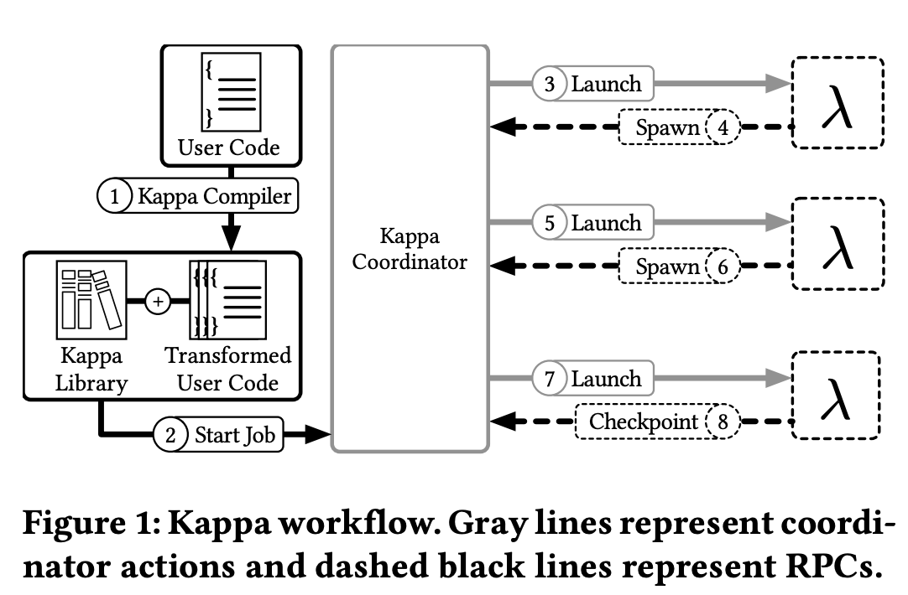
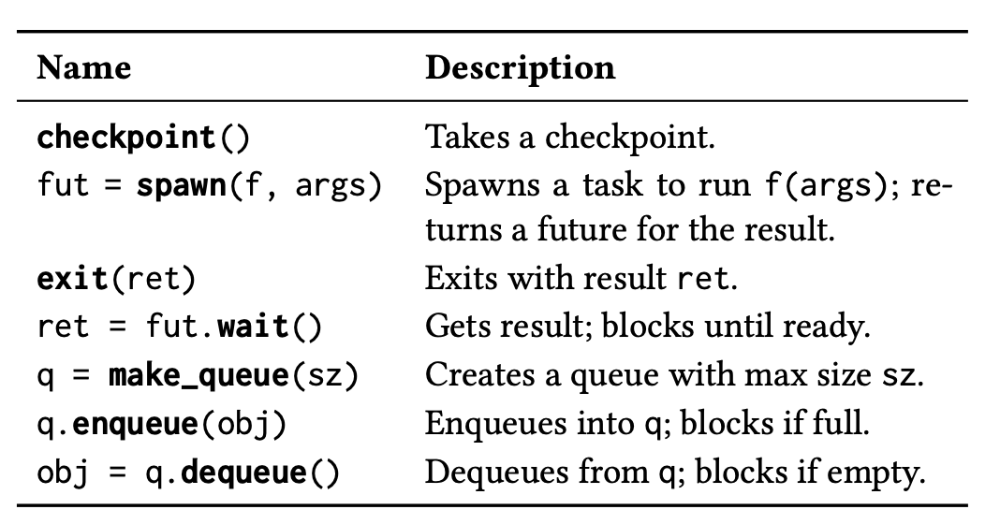
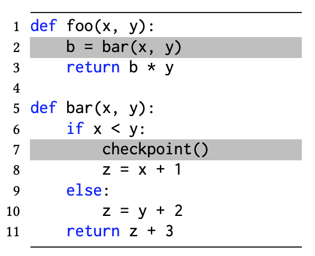
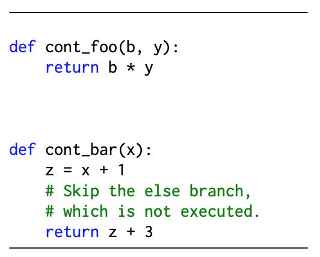
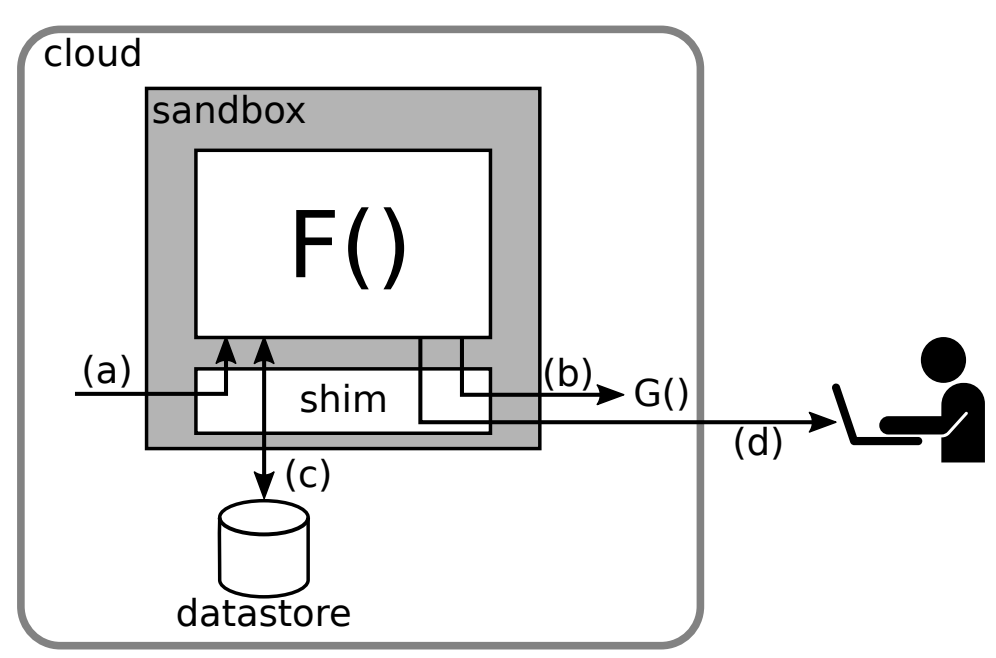
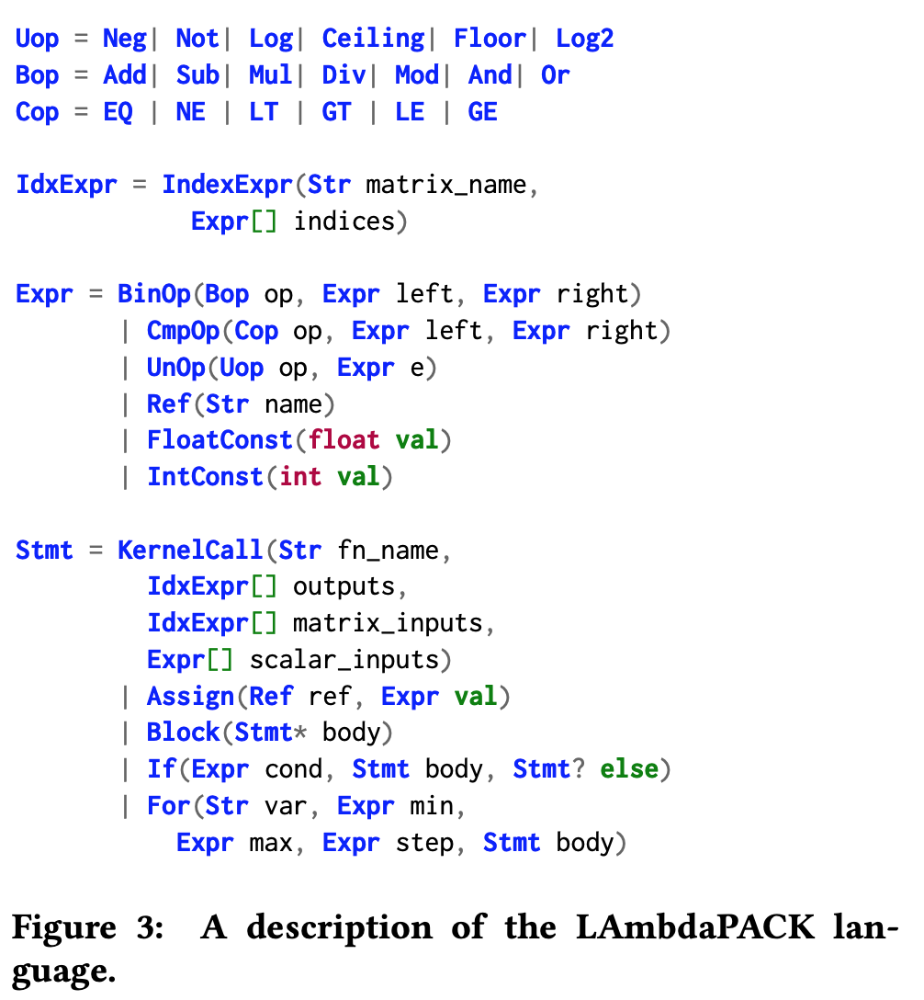
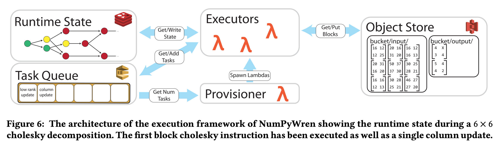

# Introduction
Serverless computing has recently emerged as a new paradigm for running software on the cloud. It's a
bit different from the usual in a sense that in this paradigm, programs need to be expressed as a set of 
short-lived tasks, each of which can complete within a short bounded time. This week we talk about 3 
different models that uses serverless computing.
1. Kappa - A Programming Framework for Serverless Computing.
2. Serverless IFC - Secure Serverless Computing using Dynamic Information Flow Control.
3. NumPyWren - Serverless Linear Algebra

# Kappa

## Introduction
Kappa is a programming framework for general-purpose, parallel serverless applications. It aims to make 
serverless development as close to ordinary parallel programming as possible. It provides solution to 
common issues like requiring users to appropriately partition their code, or develop new coordination 
mechanisms, or deal with failure recovery.

## Motivation
Serverless computing is a new cloud paradigm where, instead of provisioning virtual machines, tenants 
register event handlers with the platform. Serverless computing benefits both cloud tenants and providers.
Tenants no longer need to provision or scale their VMs, and enjoy greater elasticity from fast lambda 
boot times and providers can periodically terminate jobs running on lambda functions improving datacenter 
utilization. However, there a couple of  challenges that make developing general-purpose parallel
applications on today’s serverless platforms difficult:
1. programmers must manually partition their computation to fit within the lambda function time limit, and
2. programmers have no concurrency or synchronization primitives at their disposal, and so must
   either implement such primitives, restrict themselves to use share-nothing parallelism, or eschew 
   the use of parallel lambdas.
   
This is where Kappa steps-in and eases the development of applications on serverless platforms.

## Approach
Kappa executes parallel code of arbitrary duration using short-lived lambda functions. In Kappa, a task 
represents a logical thread of execution running in its own memory space, and physically runs on one or 
more lambda functions. We allow tasks to span multiple lambda functions by periodically checkpointing 
them. When a lambda function executing a task dies, the task is resumed on another lambda function by 
restoring the checkpoint.
Kappa offers three main features:
1. Checkpointing - To run long tasks on time-bounded lambdas, Kappa checkpoints program state periodically 
   and restores from this checkpoint upon lambda function timeout.
2. Concurrency API - To program parallel lambdas, Kappa provides a concurrency API that supports spawning 
   tasks, waiting on futures, and passing messages between lambdas.
3. Fault tolerance - Kappa tasks can exhibit nondeterminism and side effects. Using checkpoints, Kappa 
   ensures that execution never diverges due to nondeterminism, and that any side effects invoked within 
   the system are never re-executed in a face of arbitrary lambda function timeouts.
   
To support the above features, Kappa has three components: 
1. Coordinator - Responsible for launching and resuming tasks, and for implementing Kappa’s concurrency 
   primitives,
2. Compiler - Responsible for generating code required for check-pointing, and 
3. Library - Used by tasks for check-pointing, concurrent processing, and synchronization.

### Coordinator
Similar to other serverless systems, the Kappa coordinator runs as a regular process either on a VM 
instance in the cloud or on a local machine. A task (as described above) writes checkpoint content 
directly to storage, and coordinator maintains only checkpoint locations. Tasks use RPC calls to 
communicate with the Coordinator. A list of RPC calls available are:

For ex: if a task t will update its checkpoint_id by calling the checkpoint(), the Coordinator will
start the execution from there.

Checkpointing sometimes lead to code re-execution, and this can be problematic when we have side effects.
To counter this issue, Kappa makes sure that the task making an RPC call also takes a checkpoint that 
resumes execution after the RPC. The coordinator points the task’s metadata to this checkpoint
as it executes the RPC, so that it can resume a failed task from the point where the RPC returns. By 
default, the RPCs are synchronous, however, Kappa supports asynchronous calls which return as soon
as the checkpoint has been serialized locally (background process persists the checkpoint to storage and 
contacts the coordinator).

For fault tolerance of the coordinator itself, Kappa provides the option to continuously replicate 
coordinator state to a backing store. It also supports checkpoint replication to tolerate storage node 
failures.

### Checkpointing
As mentioned numerous times Kappa uses checkpoints to tolerate lambda function timeouts and to prevent 
RPC duplication. Checkpoints are implemented using continuations. Continuations can be thought of as a 
closure (i.e., a function with some associated data) that captures program state and control flow 
information at some execution point; calling the closure resumes execution from this point in the 
program.

Consider the following example:

The code is first transformed by the Kappa **compiler**, which identifies all the pause points in the 
code, i.e., locations where execution can be suspended for check-pointing. The two pause points from the
above example are highlighted; note that the call site bar(x, y) is identified as a pause point transitively
since the callee bar can cause a checkpoint to be taken.
For each pause point, the compiler generates a continuation function definition and inserts it into the 
source code which contains all the code that executes after the corresponding pause point. To reduce 
runtime overhead, Kappa generates continuation code for each pause point at compile time.

### Concurrency API
Kappa provides two basic concurrency abstractions for launching and synchronizing parallel tasks, making 
it easier to exploit the resource elasticity offered by serverless platforms.
1. Spawn - The spawn RPC launches a new task to execute a function call in parallel. It is implemented
   by initiating an initial checkpoint which when called executes the function. The coordinator then 
   invokes a lambda that restores from this checkpoint. There's a provision of map_spawn RPC, which 
   spawns multiple tasks that run the same function on different arguments; the spawned tasks share an 
   initial checkpoint.
2. FIFO queues - These are the multi-producer multi-consumer FIFO queues — a task blocks when it enqueues 
   to a full queue or dequeues from an empty queue. These semantics allow queues to be used not only for 
   inter-process communication but also as locks and semaphores. We use the on_coordinator decorator,
   which indicates that it runs as a process on the coordinator rather than on a lambda function. 
   
## Trade-offs
The on_coordinator tasks should be lightweight, otherwise coordinator machine can become a bottleneck.

Kappa expects there are no coordinator failures when dealing with external calls with side effects so
that it is never duplicated.

The use of S3 for check-pointing takes a toll on performance. However, it is more price efficient and 
requires no additional setup as opposed to Redis, thus representing the easiest option for most users.

Currently, does not support some Python features such as try/except, yield, async/await.

Kappa lacks certain features such as RPC pipelining, dependency inference, straggler mitigation, and
workflow visualization.

There are more limitations as listed in Section 6 of the paper.

## Open Questions and Future Work
Some future work includes:
1. Add support for more python features.
2. Python’s dynamic nature makes it challenging to statically analyze application code. For example, the 
   Kappa compiler does not ensure at compile time that every variable captured by a checkpoint is 
   serializable. A future direction is to implement static checking by leveraging Python type hints.
3. Adding GC features to the Kappa Framework.
4. More such examples are listed in Section 6 of the paper.

I might be wrong here, but I feel kappa could integrate Redis for check-pointing within its 
framework and abstract its usage to the users, so that we can have better performance.

# Serverless IFC

## Introduction
This paper introduces first IFC system for serverless applications, called Trapeze. Trapeze encapsulates 
each unmodified serverless function in a sandbox, which intercepts all interactions between the function 
and the rest of the world, including other functions, shared data stores, and external communication 
channels, and redirects them to the security shim (Figure 1). The shim tracks information flow and 
enforces the global security policy.

## Motivation
In May 2017, the Equifax credit reporting agency suffered a security breach, leaking social security
numbers and other personal information of 145.5 million consumers. Most of these attacks can be traced 
down to two types of faults: misconfigurations and software vulnerabilities. The enormous Trusted 
Computing Base (TCB) of modern cloud applications makes it intractable to enforce information security 
in these environments. However, a promising avenue to a smaller TCB lies in the use of information flow 
control (IFC)-based security. In the IFC world, information is protected by a global security policy 
that cannot be overridden by a mis-configured application. Despite significant progress on IFC, it 
remains difficult to apply in real software. Dynamic IFC systems often incur high runtime overhead. 
Static IFC systems shift the costs to development time, usually via the use of type systems; however, 
they restrict the style of programming, which complicates their adoption. However, the researchers
argue that serverless computing has fundamental implications for cloud security. In particular,
it may enable practical IFC for the cloud. The key observation is that a serverless function constitutes
a natural unit of information flow tracking. Hence, Trapeze.

## Approach
The reasons why a serverless IFC could work are as follows:
1. a serverless function activation handles a single request on behalf of a specific user and only 
   accesses secrets related to this request, and
2. each invocation starts from a clean state and does not get contaminated with sensitive data from 
   previous invocations. 
hence, Trapeze is based on these observations.
   
The class of supported policies, along with policy enforcement rules, is defined by Trapeze’s dynamic 
IFC model. The model addresses a weakness in many existing static and dynamic IFC systems, which leak 
information through the termination channel, whereby an adversary can infer one bit of information by 
observing termination or non-termination of the program. The Trapezes' IFC model eliminates this channel 
by enforcing a strong security property known as termination-sensitive non-interference (for detailed
explanation please refer to the paper). 

### Threat Model and Assumptions
Trapeze assumes that the following entities are trusted, i.e., not malicious or compromised: 
1. The cloud operator, 
2. Physical hosts and network, 
3. System software (OS, hypervisor, container manager, scheduler),
4. Serverless runtime,
5. Shared data stores, and 
6. The sand-boxing technology.

It further trusts the serverless application administrator to enforce the following invariants
on application configuration: 
1. All data stores used by the application are configured to only be accessible from serverless functions, 
2. All serverless functions in the system are sand-boxed, and
3. Finally, trusts the application developer to correctly define the application’s information flow 
   policy and de-classifier functions.
   
### Security Lattice
Trapeze starts the  IFC model with the lattice of security labels. Labels represent security classes of 
information flowing through the system (they typically represent users or roles of the system). For 
example, when Eve establishes an HTTP session with the system, the session gets tagged with Eve’s label e.

Given the labeling of inputs and outputs, Trapeze applies information flow rules presented below to enforce that 
information received through an input channel labeled li can only be exposed through an output channel labeled lo if 
li ⊑ lo.

### Information Flow Rules
The choice of information flow rules determines two critical properties of an IFC system: 
1. Security - characterizes the class of insecure behaviors the system prevents, and 
2. Transparency - characterizes the class of secure programs that the system executes with unmodified 
   semantics and that therefore do not need to be modified to work with Trapeze.
   
Trapeze assigns a runtime security label to every serverless function activation. This label is
derived from the event that triggered the function:
1. If the function was invoked via an HTTP request from a user, it obtains the user’s security label,
2. When invoked by another function, it inherits the caller’s label.

Trapeze also dynamically labels records in the data store. To this end, the security shim intercepts
data store operations issued by the function and modifies them to insert and check security labels. Trapeze’s 
security shim conceals the existence of data whose security label is not less than or equal to the function’s 
label. Writes with conflicting labels may introduce implicit storage channels, where the attacker infers secrets 
by observing that labeled values exist within particular store locations without observing the actual values
(refer to the paper for an example of such a case). Trapeze handles such a case by, faceted store semantics, where each
record can contain several values (facets) with different labels. Facets are created dynamically: when a value 
with a new label is stored in the record, a facet is created for it. A read returns the most recent write that 
is visible to the function. Thus, facets conceal writes with label b from a function running with label e, 
unless b ⊑ e.

The flip side of Trapeze’s strong TSNI security guarantees and light-weight protection is the theoretical loss 
of transparency, i.e., the ability to run existing unmodified applications.

## Trade-offs
Data confidentiality, i.e., protecting sensitive data from being exposed to unauthorized users. The 
complementary problem of enforcing data integrity, i.e., protecting data from unauthorized modification is 
outside the scope of Trapeze, although it can also be enforced with the help of IFC techniques.

Trapeze enforces the strong security property of TSNI at the cost of some loss of transparency.

Trapeze does not address covert timing channels.

I feel there are a lot of assumptions made by Trapeze (as described in Threat Model and Assumptions section
of the notes). Some of these are not that obvious, like the Cloud Provider can be compromised. In 
which case Trapeze would be compromised too.

## Open Questions and Future Work
Researchers are working on relaxing assumptions (1) through (5) as mention above in the notes, with the help of 
a secure enclave technology such as Intel SGX, data encryption, and software verification.

Adding support for Covert channels is also kept aside for future.

Sandbox configuration by default blocks accesses to all OS resources, including files and processes. To support 
existing serverless applications that use these resources, we would like to re-enable access to selected resources
in a secure way. To this end, Trapeze implement adapters that enforce IFC semantics for specific resource types. 
They have implemented an adapter for securely running external processes (refer to the paper for more). Support 
for other resources is a work for the future. 

It would really be nice if we had more information about how would Trapeze behave in case the Cloud provider, or,
physical hosts and network were compromised (which is not something very unlikely).

# NumPy Wren

## Introduction
NumPyWren, a system for linear algebra built on a disaggregated serverless programming model. We also introduce 
LAmbdaPACK, a companion domain specific language designed for serverless execution of highly parallel linear 
algebra algorithms.

## Motivation
Ever since cloud providers started pushing for datacenter disaggregation (as it benefits both, the datacenter 
operator and the application designer), we have seen a shift in distributed computing towards greater elasticity.
However, current distributed programming abstractions such as MPI and MapReduce rely on the tightly integrated 
resources in a collection of individual servers. Thus, in order to write applications for a disaggrated datacenter, 
the datacenter operator must expose a new programming abstraction. Thus, we turn to Serverless computing, a 
programming model in which the cloud provider manages the servers, and also dynamically manages the allocation 
of resources. But again, these close off traditional avenues for performance optimization such as exploiting 
data locality or hierarchical communication. Thus, the question arises, can we achieve comparable performance 
to an MPI-based distributed linear algebra framework, but running under the constraints imposed by the serverless 
programming model? This is when NumPy Wren steps in, a system for linear algebra workloads on serverless architectures.

## Approach
NumPyWren targets linear algebra workloads that have execution patterns similar to Cholesky decomposition (I
highly recommend reading Cholesky decomposition from the paper. It's used in many algorithms including Monte
Carlo). The main goal is to adapt to the amount of parallelism when available and NumPyWren approaches this by 
decomposing programs into fine-grained execution units that can be run in parallel. To achieve this at scale in 
a stateless setting :
1. It performs dependency analysis in a decentralized fashion.
2. Distributes a global dependency graph describing the control #ow of the program to every worker.
3. Each worker then locally reasons about its down stream dependencies based on its current position in the 
   global task graph.

We will now dive into LAmbdaPACK, a domain specific language for specifying parallel linear algebra algorithms.

### Programming Model
Classical algorithms for high performance linear algebra are difficult to map directly to a serverless environment 
as they rely heavily on peer-to-peer communication and exploit locality of data and computation – luxuries
absent in a serverless computing cluster. LAmbdaPACK tackles this situation by leveraging ideas from recent 
advances in the numerical linear algebra community on expressing algorithms as directed acyclic graph based 
computation. Using LAmbdaPACK, users can succinctly express tiled linear algebra algorithms. These routines 
express their computations as operations on matrix tiles, small submatrices that can fit in local memory. 
The main distinction between tiled algorithms, and the classical algorithms found in libraries like ScaLAPACK 
is that the algorithm itself is agnostic to machine layout, connectivity, etc., and only defines a computational 
graph on the block indices of the matrices.

### Language Design
Primary role of the LAmbdaPACK program is to sequence kernel calls, and compute the tile indices for each call.
These programs can perform basic arithmetic and logical operations on scalar values. They cannot directly read 
or write matrix values; instead, all substantive computation is performed by calling native kernels on matrix 
tiles programs. LAmbdaPACK include simple for loops and if statements, but there is no recursion, only a single 
level of function calls, from the LAmbdaPACK routine to kernels. These simple primitives are powerful enough to 
concisely implement algorithms such as Tall Skinny QR (TSQR), LU, Cholesky, and Singular Value decompositions 
(example below).

### System Design
The current system design consists of five major components that are independently scalable: 
1. Runtime state store,
2. A task queue,
3. A lightweight global task scheduler, 
4. A serverless compute runtime, and 
5. A distributed object store. 

The execution proceeds in the following steps:
1. Task Enqueue - The client process enqueues the first task that needs to be executed into the task queue. The 
   task queue is a publish-subscribe style queue that contains all the nodes in the DAG whose input dependencies 
   have been met and are ready to execute.
2. Executor Provisioning - Provisioner manages compute resources to match the dynamic parallelism during execution. 
   After first task is enqueued, the provisioner launches an executor, and maintains the number of active 
   executors based on task queue size.
3. Task Execution - Executors manage executing and scheduling NumPyWren tasks. Once an executor is ready, it 
   polls the task queue to fetch a task available and executes the instructions encoded in the task.
4. Runtime State Update - Once the task execution is completed and the output has been persisted, the executor 
   updates the task status in the runtime state store
   
NumPyWren also achieves Fault Tolerance. It does so by leveraging a lease mechanism, which allows the system to 
track task status without a scheduler periodically communicating with executors. The lease mechanism as 
following:
1. All the pending and executable tasks are stored in a task queue.
2. They can only be deleted  from the queue once they are completed (i.e., the runtime state store has been 
   updated, and the output persisted to the object store).
3. When a task is fetched by a worker, the worker obtains a lease on the task.
4. For the duration of the lease, the task is marked invisible to prevent other workers from fetching the same 
   task

How does NumPyWren handle Failure Detection and Recovery?
During normal operation, the worker will renew lease of the task using a background thread until the task is 
completed. If the task completes, the worker deletes the task from the queue. If the worker fails, it can no 
longer renew the lease, and the task will become visible to any available workers. Thus, failure detection 
happens through lease expiration and recovery latency is determined by lease length.

## Trade-offs
NumPyWren does not support recursion. It only has compatibility to simple for loop and if conditions.

As of now, NumPyWren only supports imperative code. There's no mention of support for other paradigms.

NumPyWren cannot directly read or write matrix values, they can only read one tile at a time.

## Open Questions and Future Work
NumPyWren researchers have parked a more rigorous  investigation on scaling factors f and Ttimeout. (Kindly 
refer to section 5.4 System Ablations).

As datacenters continue their push towards disaggregation, platforms like NumPyWren open up a fruitful area of 
research for applications that have long been dominated by traditional HPC.
