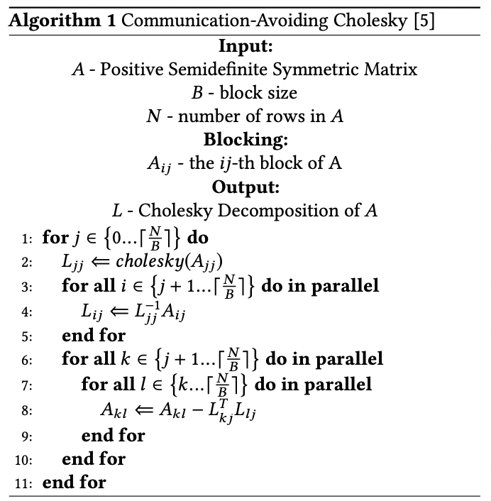

# Introduction
A brief look into Serverless Programming Models:
* Kappa: A Programming Framework for Serverless Computing.
* NumPyWren: Serverless Linear Algebra.
* Serverless IFC: Secure Serverless Computing using Dynamic Information Flow Control.

# Kappa: A Programming Framework for Serverless Computing

## Introduction

Serverless computing is a new cloud paradigm where, instead of provisioning virtual machines (VMs), tenants register event handlers (e.g., Python functions) with the platform. When an event occurs, the platform invokes the handler on a lambda function, a short-lived, stateless execution environment. A lambda function can execute for a bounded duration before being terminated.

Serverless computing benefits both cloud tenants and providers. Tenants no longer need to provision or scale their VMs, and enjoy greater elasticity from fast lambda boot times (100s of ms on AWS). Providers can periodically terminate jobs running on lambda functions (and place the next invocation elsewhere if desired), improving datacenter utilization.

## Motivation

Developing general-purpose parallel applications on today’s serverless platforms remains difficult due to two main challenges: 
1. Programmers must manually partition their computation to fit within the lambda function time limit. They usually assume that
each task can run for an arbitrary duration until it completes. Lambda functions, however, are time-bounded and thus might not complete a task of arbitrary length.  
2. Programmers have no concurrency or synchronization methologies at their disposal, and so must either implement such methologies or restrict themselves to use share-nothing parallelism, or stay clear of parallel lambdas all together.

Kappa aims to make serverless development as close to ordinary parallel programming as possible. A programmer can write ordinary
Python code using a familiar concurrency API (e.g., tasks and futures), and Kappa runs the code on an unmodified serverless platform like AWS Lambda using parallel lambda functions.

Kappa requires no changes to the platform, thus allowing general applications to run on existing serverless offerings, which is the main contribution of this work.

## Approaches

**Kappa Design**
Kappa executes parallel code of arbitrary duration using short-lived lambda functions. 
Here, a **task** represents a logical thread of execution running in its own memory space, and can physically runs on one or more lambda functions. Tasks are allowed to span multiple lambda functions by periodically checkpointing them.
Kappa enables concurrent processing by allowing each task to spawn other tasks which execute in parallel, and by providing inter-task communication mechanisms that allow tasks to communicate and coordinate with each other.

Kappa has three components: 
1. Kappa Coordinator : responsible for launching and resuming tasks and for implementing Kappa's concurrency primitives.
2. Kappa Compiler : responsible for generating code required for checkpointing.
3. Kappa library : used by tasks for checkpointing, concurrent processing, and synchronization.

**Flow**

1. Programmer writes code similar to what runs on a traditional platform, with minor modifications required by Kappa.
2. The compiler transforms this code into a form suitable for use by Kappa.
3. The program is packaged with the Kappa library and launched by the coordinator, which starts by running a designated “main” task.

**Coordinator**
1. The Kappa coordinator is responsible for scheduling tasks on lambda functions, implementing synchronization and cross-task communication, tracking task metadata (including checkpoints), and providing fault tolerance.
2. The coordinator tracks the latest checkpoint of each task. A task writes checkpoint content directly to storage (e.g., S3 or Redis), and the coordinator maintains only checkpoint locations.
3. Tasks communicate with the coordinator through the remote procedure calls (RPCs) like below:

4. Coordinator RPCs are synchronous by default. Also supports asynchronous RPCs, which return as soon
as the checkpoint has been serialized locally. A background process then persists the checkpoint to storage and contacts the coordinator. 
(**Note:** Because the actual RPC logic is executed at the coordinator, no processing occurs until the coordinator has been contacted. As a result, in case the lambda is killed before the coordinator is contacted, it is safe to restore the task to its previous checkpoint (before the RPC is issued).

5. For RPCs which are **blocking** (e.g., wait), a task blocks by first busy-waiting for a configurable period (1 s by default), and then quitting the lambda function. In the latter case, the task is resumed by the coordinator once unblocked. This provides better resource efficiency than pure busy waiting and better performance than immediately blocking.

6. For **fault tolerance** of the coordinator itself, Kappa provides the option to continuously replicate coordinator state to a backing store (currently, a Redis cluster using primarybackup replication). With this option enabled, every time the
coordinator processes an RPC or a lambda function timeout, it sends a state update to the backing store and waits for it to be persisted. The coordinator can reconstruct its previous state from the store and resume the workload upon failure.  
Further, the overhead of backing store can be further reduced by having the coordinator send batch updates periodically.

**Checkpointing**

Kappa uses checkpoints to tolerate lambda function timeouts and to prevent RPC duplication. 
Checkpoints in Kappa are implemented using **continuations**, a language-level mechanism executed in user mode.

A **continuation** can be thought of as a closure (i.e., a function with some associated data) that captures program state and control flow information at some execution point. Calling the closure resumes execution from this point in the program.

Kappa takes a checkpoint by generating a continuation and serializing it to storage, and restores from a checkpoint by deserializing and invoking a previously stored continuation. Kappa's continuations implementation is specialized to Python. 

**Generating continuation functions:** To reduce runtime overhead, Kappa generates continuation code for each pause point at compile time. Pause points can be inserted manually (by invoking an RPC) or automatically by the compiler using a simple heuristic—before each function call, checkpoint if five seconds has elapsed since the previous checkpoint. 

**Runtime behavior** At every pause point, our compiler inserts an exception handler that creates a continuation upon catching an exception. To make an RPC, the Kappa library records details of the call and raises a special exception, triggering
the exception handler at every level of the call stack. Each handler appends a new continuation and re-raises the exception. Finally, the top-most handler, part of the Kappa library, serializes and persists the list of continuations.

**Concurrency API**

Kappa provides mechanisms for launching and synchronizing parallel tasks, making it easier to exploit the resource elasticity offered by serverless platforms.
1. **Spawn:** The spawn RPC launches a new task to execute a function call in parallel and returns a future for the result.
2. **FIFO queues:** Kappa tasks can communicate using multiproducer multi-consumer FIFO queues.

**External Services**

A Kappa task can call services external to the platform (e.g., a REST API for computer vision). 

Interactions with external services pose two fault tolerance challenges: 
Kappa must ensure that: 

1. External calls with side effects be issued only once even when lambdas time out.
2. Calls that last longer than the lambda time limit make progress.

Kappa solves both challenges in an extensible manner using spawn.

The programmer wraps a stateful external call in a child task, spawns it on the coordinator, and waits for it to finish.
The RPC mechanism ensures that the spawn, and thus the external service call, is never duplicated (assuming no coordinator failures). 
In case of a long-lasting call, the wait would block, causing the parent task to terminate and restart when the child finishes.

**Comparing Platforms**

To use most of the previous frameworks, the programmer must:
1. Partition the computation into small components, each of which must fit within the lambda functiontime limit and meet other framework-specific restrictions (e.g., to simplify fault tolerance)
2. Compose these components into a serverless application using a framework-specific format.

Kappa’s checkpointing mechanism can resume a task when a lambda function times out, freeing the programmer from having to manually partition their computation. 
Kappa’s high-level concurrency API lets programmers develop parallel serverless applications using a familiar programming model.

## Tradeoffs

Tasks may lose some progress and re-execute some code as a result of being restarted.

The Kappa compiler conservatively assumes every function call to be a transitive pause point and generates a continuation function for it. This strategy bloats the transformed code. (Although they found that the resulting code size is still negligible compared to the Kappa and third-party libraries)

The overhead of checkpointing could be higher for other languages, as the compiler wraps every function call in a
try/except block.

Kappa uses storage services for checkpoints and large queue elements, they currently support only using S3 and Redis for storage. 

Garbage collection (GC) is currently implemented only for Redis. ( For S3: Since S3 storage is cheap, they simply delete all S3 objects when a workload ends)

Python’s yield keyword which suspends a function and transfers control to its caller is not used as they are unaware of any
portable technique for serializing the suspended state.

Static pause points restricts where checkpoints can be generated and precludes deciding checkpoint locations at runtime.

Kappa can checkpoint only in code transformed by the its compiler and not in, example a Python C extension like numpy.

The Kappa compiler does not ensure at compile time that every variable captured by a checkpoint is serializable, showing lack of static checking.

The programmer must Insert checkpoint() calls at appropriate points in the program, mark calls that have externally visible side-effects along with ensuring that such calls are executed only once.  They have to use Kappa’s concurrency primitives instead of primitives such as Python threads.

## Open Questions and Future Work

Kappa has unsupported Python features to the compiler’s continuation generation logic. These features include try/except, yield, async/await, nested function definitions, and global variables. These limitations are not fundamental but can be future work.

Kappa currently checkpoints if five seconds has elapsed since the previous checkpoint. Finding better methods is a future work.

Removing Restrictions like where in code the checkpoints can be generated and deciding checkpoint locations before runtime and coming up with dynamic continuation computation is an area to work on.

A future direction can be to implement static checking by leveraging Python type hints.

Adding the unimplemented GC features.

# NumPyWren: Serverless Linear Algebra.

## Introduction

NumPyWren is a system for linear algebra built on a disaggregated serverless programming model, along with LAmbdaPACK, a domainspecic language designed for serverless execution of highly parallel linear algebra algorithms.

NumPyWren in summary executes programs written using LAmbdaPACK, a high level DSL that can succinctly express arbitrary tile-based linear algebra algorithms. NumPyWren analyzes the data dependencies in LAmbdaPACK and extracts a task graph for parallel execution. NumPyWren then runs parallel computations as stateless functions while storing intermediate state in a distributed object store.

## Motivation

NumPyWren broadly focuses on the case of large-scale dense linear algebra. The main motivation is derived from the communication and computation patterns of a core subroutine in solving a linear system, Cholesky factorization.
The algorithm's dynamic parallelism during execution and fine-grained dependencies between the steps are hard to exploit in single program multiple data (SPMD) or bulk synchronous parallel (BSP) systems such as MapReduce or Apache Spark, where global synchronous barriers are enforced between steps. This is where NumPyWren comes in.

## Approaches

NumPyWren targets linear algebra workloads that have execution patterns similar to Cholesky decomposition as below:

NumPyWren's goal is to adapt to the amount of parallelism when available and they approach this by decomposing programs into fine-grained execution units that can be run in parallel at scale in a stateless setting by performing dependency analysis in a decentralized fashion.

NumPyWren distributes a global dependency graph describing the control flow of the program to every worker.
Each worker then locally reasons about its down stream dependencies based on its current position in the global task
graph. 

**PROGRAMMING MODEL: LAmbdaPACK**

LAmbdaPACK, which is a domain specific language, allows for compact representations of these global dependency graphs.

Classical algorithms for high performance linear algebra are difficult to map directly to a serverless environment as they rely heavily on peer-to-peer communication and exploit locality of data and computation, which are absent in a serverless computing cluster.

LAmbdaPACK expresses algorithms as directed acyclic graph (DAG) based computation. It does not require the user to pre-specify a DAG of linear algebra kernels, but rather infers the program DAG from an imperative program.

LAmbdaPACK allows users to succinctly express tiled linear algebra algorithms. These routines express their computations as operations on matrix tiles, small submatrices that can it in local memory.

The main distinction between tiled algorithms and the classical algorithms is that the algorithm itself is agnostic to machine layout, connectivity, etc and only defines a computational graph on the block indices of the matrices.

This uniform, machine independent abstraction for defning complex algorithms allows LAmbdaPACK to adapt most standard linear
algebra routines to a stateless execution engine.

**Language Design:**

LAmbdaPACK programs are simple imperative routines which produce and consume tiled matrices. 
These programs can perform basic arithmetic and logical operations on scalar values. They cannot directly read or write matrix values.
All substantive computation is performed by calling native kernels on matrix tiles. Matrix tiles are referenced by index, and the primary role of the LAmbdaPACK program is to sequence kernel calls, and compute the tile indices for each call.

LAmbdaPACK programs include simple for loops and if statements, but there is no recursion, only a single level
of function calls, from the LAmbdaPACK routine to kernels. Each matrix tile index can be written to only once.

**Program Analysis:**

Program analysis runs in two stages.
1. The frst stage analyzes a program and extracts a compressed DAG of tasks.
2. At runtime when, after a task is executed, the downstream tasks are dynamically discovered.

Naively converting the program into an executable graph will lead to a DAG explosion as the size of the data
structure required to represent the program will scale with the size of the input data, which can lead to intractable compilation times. Using techniques from the loop optimization community, NumPyWren, converts a LAmbdaPACK program into an implicit directed acyclic graph.

**Visualisation:** 

**SYSTEM DESIGN**

To fully leverage the elasticity and ease-of-management of the cloud,  NumPyWren is built entirely upon existing cloud services while ensuring the performance and faulttolerance goals for high performance computing workloads.

System design consists of five major components that are independently scalable.
1. Runtime state store.
2. Task queue.
3. A lightweight global task scheduler.
4. A serverless compute runtime.
5.  A distributed object store.

The execution proceeds in the following steps:

1. **Task Enqueue:** The client process enqueues the first task that needs to be executed into the task queue. The task queue
is a publish-subscribe style queue that contains all the nodes in the DAG whose input dependencies have been met and are ready to execute.

2. **Executor Provisioning:** The length of the task queue is monitored by a provisioner that manages compute resources to match the dynamic parallelism during execution. After the first task is enqueued, the provisioner launches an executor, and maintains the number of active executors based on task queue size. As the provisioner’s role is only lightweight it can also be executed periodically as a "serverless" cloud function.

3. **Task Execution:** Executors manage executing and scheduling NumPyWren tasks. Once an executor is ready, it polls the task queue to fetch a task available and executes the instructions encoded in the task.

4. **Runtime State Update:** Once the task execution is complete and the output has been persisted, the executor updates the task status in the runtime state store. The runtime state store tracks the control state of the entire execution and
needs to support fast, atomic updates for each task.

**Fault tolerance**
Fault tolerance in NumPyWren is much simpler to achieve due to the disaggregation of compute and storage. Because
all writes to the object store are made durable, no recomputation is needed after a task is finished. 

Fault tolerance in NumPyWren is reduced to the problem of recovering failed tasks rather than usual replay from checkpoints.

NumPyWren re-executes failed tasks via a lease mechanism, which allows the system to track task status without a scheduler
periodically communicating with executors. When a task is fetched by a worker, the worker obtains a lease on the task.
For the duration of the lease, the task is marked invisible to prevent other workers from fetching the same task and the worker needs to renew the lease periodically.

**For Failure Detection and Recovery:** 
During normal operation, the worker will renew lease of the task using a background thread until the task is completed. If the task completes, the worker deletes the task from the queue. If the worker fails, it can no longer renew the lease and the task
will become visible to any available workers. Thus, failure detection happens through lease expiration and recovery latency is determined by lease length.

**Garbage Collection:** NumPyWren stores all intermediate state to a persistent object store and does GC at the end. It asynchronously cleans the object store by launching a set of parallel serverless tasks to clean up all objects.

**Autoscaling:** NumPyWren’s auto-scaling framework tracks the number of pending tasks and periodically increases the number of running workers to match thetasks with a scaling factor.

## Tradeoffs
LAmbdaPACK programs are imperative routines. 

These programs can perform only basic arithmetic and logical operations on scalar values. 

They cannot directly read or write matrix values.

As long as the coarsness of tasks is chosen such that many tasks can be successfully completed in the allocated time interval, they do not see too large of a performance penalty for timely worker termination, which could change on the coarsness of tasks. 

Evaluations of NumPyWren are on just 4 linear algebra algorithms Matrix Multiply (GEMM), QR Decomposition (QR) , Singular Value Decomposition (SVD) 2 and Cholesky Decomposition (Cholesky).

Launch Overheads which is partly due to lambda invocation rate limits imposed by AWS and partly due to the time taken to setup our custom Python runtime.

## Open Questions and Future Work

As datacenters continue their push towards disaggregation, platforms like NumPyWren open up a fruitful area of research for applications that have long been dominated by traditional HPC.

Support more languages and range of applications.