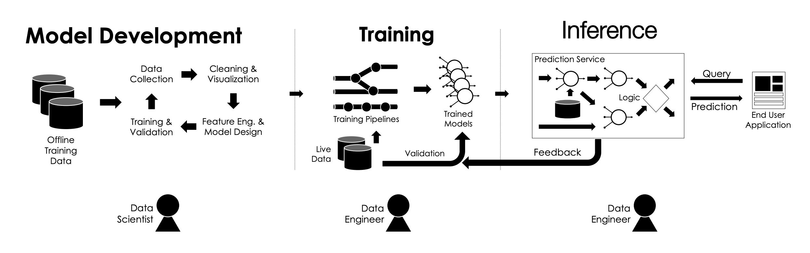
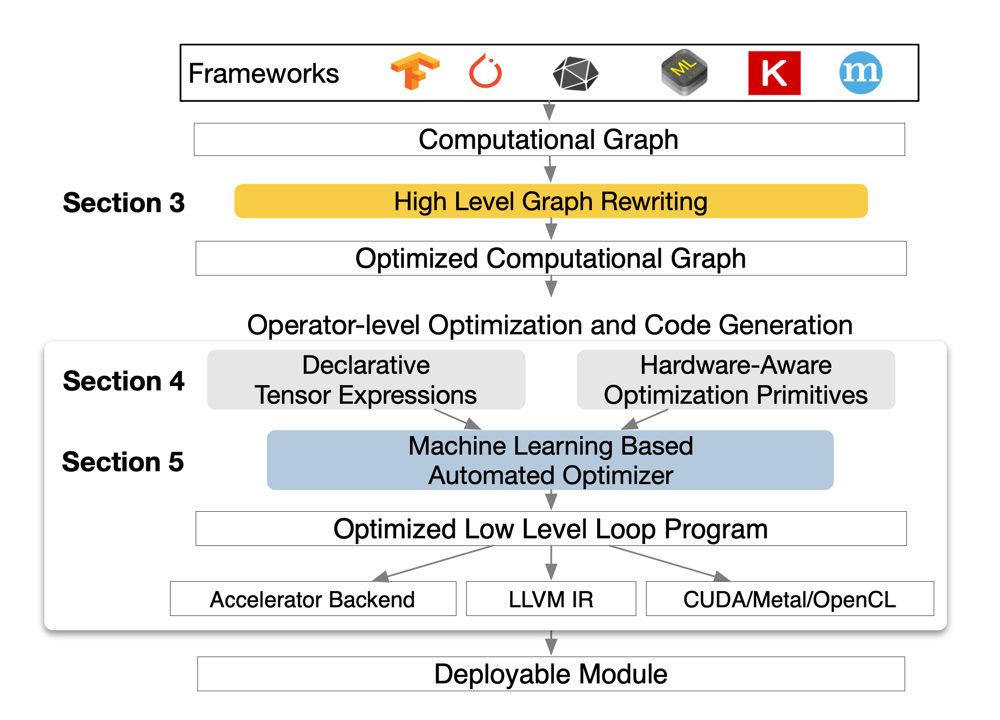
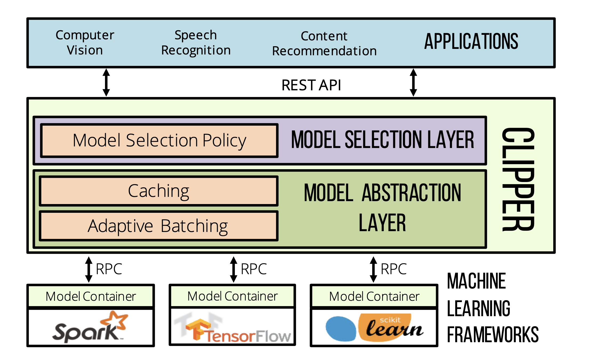

# Introduction
Each of the the three papers summarized below handle different parts of a ML development lifecycle. 

Imagine you download a popular Deep Learning framework such as Pytorch or TensorFlow and you want to run train a model on your laptop however each computer has different hardware and you realize that the model trains slower on your laptop than others. This is where **TVM** comes into play. TVM is a compiler that takes a high-level specification of a deep learning program from existing frameworks and generates low-level optimized code for a diverse set of hardware backends.

Now that your code is running well locally, you realize that the NYU cluster has better resources and you decide to train your model there. But how can you make sure that the code you wrote to run on just one machine will work parallely across multiple GPUs across a network. This is where **PyTorch Distributed** comes into play. It outlines the technique of distributed data parallelism which replicates the model on every computational resource to generate gradients independently and then communicates those gradients at each iteration to keep model replicas consistent.

Once you have trained your model, you want to deploy it so that other people can use it to make their lives easier. How do you ensure scalability if your app becomes popular. This is where Clipper comes into play. **Clipper** is a general-purpose low-latency prediction serving system which has  a modular architecture to simplify model deployment across frameworks and applications. It reduces prediction latency and improves prediction throughput, accuracy, and robustness without modifying the underlying machine learning frameworks.

## Pre-knowledge
**Hardware primitives:** It is a process that is composed of several instructions and is used to complete a certain function. Primitive or atomic action is a program composed of several machine instructions to complete a certain function, and it is indivisible. That is, the execution of primitive must be continuous, and it is not allowed to be interrupted during the execution.

**Memory Latency Concealment:** Latency refers to the delay from requesting to receiving the response; memory delay refers to the delay caused by waiting for the completion of the access to the data stored in the system memory. Memory hiding latency is accomplished by concurrent operations of memory reads.

**AllReduce** AllReduce operation expects each participating process to provide an equally-sized tensor, collectively applies a given arithmetic operation (e.g., sum, prod, min, max) to input tensors from all processes, and returns the same result tensor to each participant.

# Motivation

### TVM
Mapping DL workloads to various hardware devices such as CPUs, GPUs, FPGAs, and TPUs is complicated because of the diversity in how each of them are designed to handle things like memory organization, compute functional units etc.

Addionally, current DL frameworks optimize only on computational graphs. However, these are often too high-level to handle hardware backend specific operator-level transformations. They delegate these transformations to vendor operator libaries (such as CuDNN) which require a lot of engineering effort to build and fine-tune and hence are too specialized and opaque to be easily ported across hardware devices. Even if vendor libraries exist, these frameworks are limited because they need to avoid graph optimizations that yield new operators not in the predefined operator library.

### PyTorch Distributed
PyTorch builds an autograd graph to record actions performed. Then, in the backward pass, it uses the autograd graph to conduct backpropagation to generate gradients. The purpose of data parallel is to speed up these training steps on large datasets. To ensure the success of PyTorch Distributed, it needs:
1. Mathematical equivalence - Applications expect to harvest the same result model as if all training had been performed locally without model replication
2. Non-intrusive and interceptive API - Development usually starts from local models and then scales out when necessary, thus the developer should be able to reuse the local training script with minimal modifications. while exposing as many optimization opportunities as possible to the internal implementation.
 3. High Performance - Efficiently convert more resources into higher training throughput.

### Clipper
Prediction serving requires integrating machine-learning software with other systems including user-facing application code, live databases, and high-volume data streams. As such, it comes with its own set of challenges and tradeoffs and is the domain of the emerging class of prediction-serving systems. Compounded by the fact that there is a large and growing number of machine learning frameworks. Each framework has strengths and weaknesses and many are optimized for specific models or application domains. Thus, huge systems incur a substantial increase in complexity of integrating and supporting multiple machine learning frameworks. Moreover, predictions must be both fast and have bounded tail latencies to meet service level objectives.

# Approaches
### TVM
The main challenges TVM faces is making a single system that leverages various corresponding hardware specific features and abstractions as well as searching the large space created by the combination of different memory access, threading pattern, and novel hardware primitives for the most optimal pick. To solve these problems, TVM introduces these key modules:

1. High Level Graph Rewriting - 
    Computational graphs provide a global view of operators, but they avoid specifying how each operator must be implemented. These can be transformed into functionally equivalent graphs to apply optimizations. This is done using
    1. Operator Fusion - This combines multiple operators into a single kernel without saving the intermediate results in memory
    2. Constant-Folding - This precomputes graph parts that can be determined statically, saving execution costs
    3. Static Memory Planning Pass - This preallocates memory to hold each intermediate tensor.
    4. Data Layout transformations - This converts a computational graph into one that can use better internal data layouts for execution. For instance, a DL accelerator might exploit 4 × 4 matrix operations, requiring data to be tiled into 4 × 4 chunks to optimize for access locality.
2. Tensor Operations Generator - 
    TVM produces efficient code for each operator by generating many valid implementations on each hardware back-end and choosing an optimized implementation. This is done by decoupling the algorithm definition from its execution strategy, to improve portability and composability. 
    TVM introduces a Tensor Expression Language to support automatic code generation, there exist specific mappings from an expression to low-level code and there can be multiple mappings for the a similar function. 
    It also enables groups of threads to cooperatively fetch the data they all need and place it into a shared memory space thus utilizing GPU memory hierarchy and enabling data reuse across threads through shared memory regions.
    Additionally, it semalessly integrates Tensor compute primitives while making sure it is easily extensible. TVM also exposes a virtual threading scheduling primitive that lets programmers specify a high-level data parallel program as they would a hardware back-end with support for multithreading. 
3. ML based Automated Optimization - 
    TVM uses a schedule explorer which proposes configurations that may improve an operator’s performance. For each schedule configuration, it uses an Gradient Tree Boosting model that takes the lowered loop program as input and predicts its rank compared to other generated programs based on the estimated run time on a given hardware back-end. The ML model is trained using runtime measurement data collected during exploration, does not require the user to input detailed hardware information. The explorer starts with random configurations, and, at each step, randomly walks to a nearby configuration. This transition is successful if cost decreases as predicted by the cost model. The schedule explorer queries the cost model frequently, which incurs overheads due to model prediction time and model refitting time.

### PyTorch Distributed
To keep in line with the Mathematical Equivalence property, we start with the same model state and consume the same gradients in every iteration. The naive solution to Gradient reduction is to scan through all local model parameters, and retrieve the gradient tensor from each parameter. Then, use the AllReduce call to calculate the average gradients on each parameter across all processes, and write the result back to the gradient tensor. However, there are two problems with this approach.
1. Collective communication performs poorly on small tensors. This is solved by **Gradient Bucketing**. DDP achieves higher throughput and lower latency if it waits for a short period of time and buckets multiple gradients into one AllReduce operation. However, DDP should not communicate all gradients in one single AllReduce, otherwise, no communication can start before the computation is over. Thus, with relatively small bucket sizes, DDP can launch AllReduce operations concurrently with the backward pass to overlap communication with computation, which would make a difference in per iteration latency. The optimal value lives in around 25 MB and depends on the type of communication backend employed.
2. Separating gradient computation and synchronization forfeits the opportunity to overlap computation with communication. With bucketing, DDP only needs to wait for all contents in the same bucket before launching communications. However, the reducing order must be the same across all processes, otherwise, AllReduce contents might mismatch. All processes must use the same bucketing order, and no process can launch AllReduce on bucket i+1 before embarking bucket i. Additonally, it is possible that one training iteration only involves a sub-graph in the model and the sub-graph can be different from iteration to iteration, meaning that some gradients might be skipped in some iterations. DDP traverses the autograd graph from the output tensors of the forward pass to find all participating parameters. DDP uses a bitmap to keep track of local parameter participants and launches one additional AllReduce to collect globally unused parameters.

DDP is built on top of collective communication libraries, including three options, NCCL, Gloo, and MPI. DDP takes the APIs from the three libraries and wraps them into the same ProcessGroup API. PyTorch v1.5 provides a composite round-robin ProcessGroup implementation, which takes a list of ProcessGroup instances and dispatches collective communications to those ProcessGroup instances in a round-robin manner. By using round-robin ProcessGroups, DDP can attain higher bandwidth utilization if a single NCCL, Gloo, or MPI ProcessGroup is unable to saturate the link capacity.

### Clipper
Clipper introduces a model abstraction layer and common prediction interface that isolates applications from variability in machine learning frameworks. Clipper automatically and adaptively batches prediction requests to maximize the use of batch-oriented system optimizations in machine learning frameworks while ensuring that prediction latency objectives are still met. Clipper employs straggler mitigation techniques to reduce and bound tail latency, enabling model developers to experiment with complex models without affecting serving latency. Clipper leverages adaptive online model selection and ensembling techniques to incorporate feed-back and automatically select and combine predictions from models that can span multiple machine learning frameworks.

1. Model Containers - 
Each model is managed in a separate Docker container to provide process isolation. Clipper supports replicating model containers, both locally and across a cluster, to improve prediction throughput and leverage additional hardware accelerators. 
2. Model Abstraction Layer - 
It is composed of a prediction cache, an adaptive query-batching component, and a set of model containers connected to Clipper via a lightweight RPC system.
The prediction caches provide a partial pre-materialization mechanism for frequent queries and the Clipper batching component transforms the concurrent stream of prediction queries received by Clipper into batches.  
Batching helps amortize the cost of system overheads (e.g., remote procedure call and feature method invocation) and improves throughput by enabling models to leverage internal parallelism. For example, many machine-learning frameworks are optimized for batch-oriented model training and therefore capable of using SIMD (single instruction, multiple data) instructions and GPU accelerators to improve computation on large input batches. However, batching may increase the latency of predictions since it requires all queries in the batch to complete before returning a single prediction. Clipper solves this problem by employing an AIMD scheme to find the optimal batch size that maximizes throughput subject to constraint that the batch evaluation latency is under the target SLO. Clipper employs an LRU eviction policy for the prediction cache, using the standard CLOCK cache eviction algorithm.
3. Model Selection Layer - 
The Model Selection Layer uses feedback to dynamically select one or more of the deployed models and combine their outputs to provide more accurate and robust predictions. The selection policy uses reward feedback to choose between and even combine multiple candidate models for a given prediction request. By selecting the optimal model or set of models to use on a per-query basis, Clipper makes machine-learning applications more robust to dynamic environments and allows applications to react in realtime to degrading or failing models. Applications can choose to only accept predictions above a confidence threshold by using the robust model selection policy. The selection policy interface is designed to support ensemble methods and explore/exploit techniques that can express a wide range of such methods, including multiarmed bandit techniques and the Thompson sampling algorithm used by LASER. To address stragglers, Clipper introduces a simple best- effort straggler-mitigation strategy motivated by the design choice that rendering a late prediction is worse than rendering an inaccurate prediction. For each query the model selection layer maintains a latency deadline determined by the latency SLO.

# Trade-Offs

### TVM
Using TVM only makes sense if the technique is fixed. Currently in the field of Deep Learning there is a lot of innovation going around and new architectures are being experimented with. If after each change in code, we needed to run a Automated optimization system which searches through a huge space (albiet faster than others), it doesnt represent the fast nature of experimenting.
An ML based approach is favored over auto-tuning and pre-defined cost model. We can see that it is not guaranteed to give the best approach amongst the entire search space. A lot relies on the randomly generated configurations.

### PyTorch Distributed
Parameter Averaging vs Gradient Syncronization - Instead of synchronizing gradients, parameter averaging directly computes the average of all model parameters. It is attractive because it can easily and cleanly decouple the code of distributed training and local iterations. However, Parameter averaging can produce vastly different results compared to local training like when optimizer relies on past local gradients values (e.g., momentum). Additionally, computation (i.e., backward pass) and communication (i.e., computing average) into non-overlapping phases  one type of resource will stay idle at any given time instance, giving up a substantial performance optimization opportunity.

Communication Backend: NCCL is considerably faster than Gloo in most use cases. There is a significant slow-down with NCCL backend when scaling models across machine boundaries, if the bandwidth across machines is considerably lower than that between same-machine GPUs.

### Clipper
Clipper architecture which assumes models are below Clipper in the software stack, and thus are treated as black-box components. Clipper does not optimize the execution of the models within their respective machine learning frameworks.
Clipper does not manage the training or retraining of the base models within their respective frameworks

# Open Questions and Future Work

### TVM
1. How does it handle outliers?
2. Unified runtime for heterogenous devices on a cluster
3. Automate all aspects inlcusing high level optimizations nad hardware specific ones

### PyTorch Distributed 
1. Gradient Order Prediction - Although DDP cannot deterministically detect the backward computation order on all parameters at construction time, the order usually does not change that often in practice. One viable solution is to trace the backward order using autograd hooks and update parameter to bucket mapping accordingly.
2. Layer Dropping - One technique to accelerate training and avoid overfitting is to randomly drop layers during the forward pass. fixed parameter-to-bucket mapping. As AllReduce uses a bucket as the minimum granularity, it cannot judiciously react to vacancies in buckets 
3. Gradient Compression - Reduce the volume of data for communication by compressing gradients
4. Auto-tuning various parameters

### Clipper
1. How do we integrate both model and system knowledge?
2. Latency and accuracy tradeoff (lower precision inputs to improve performance, model distillation)
