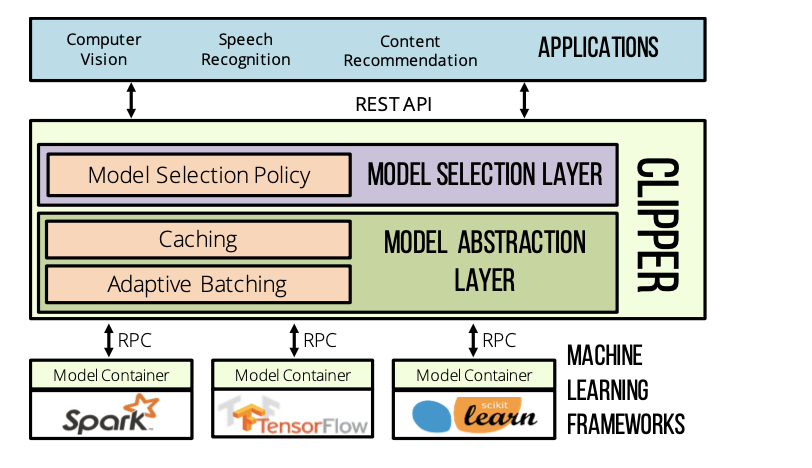
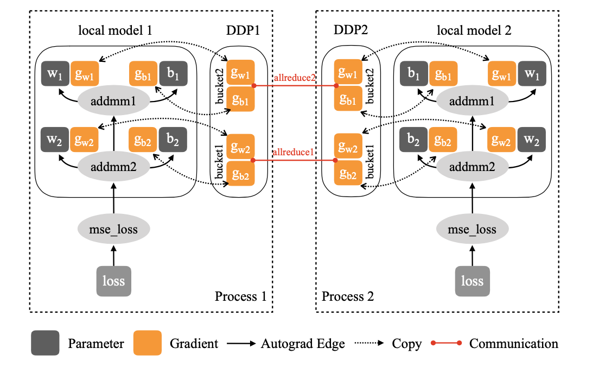
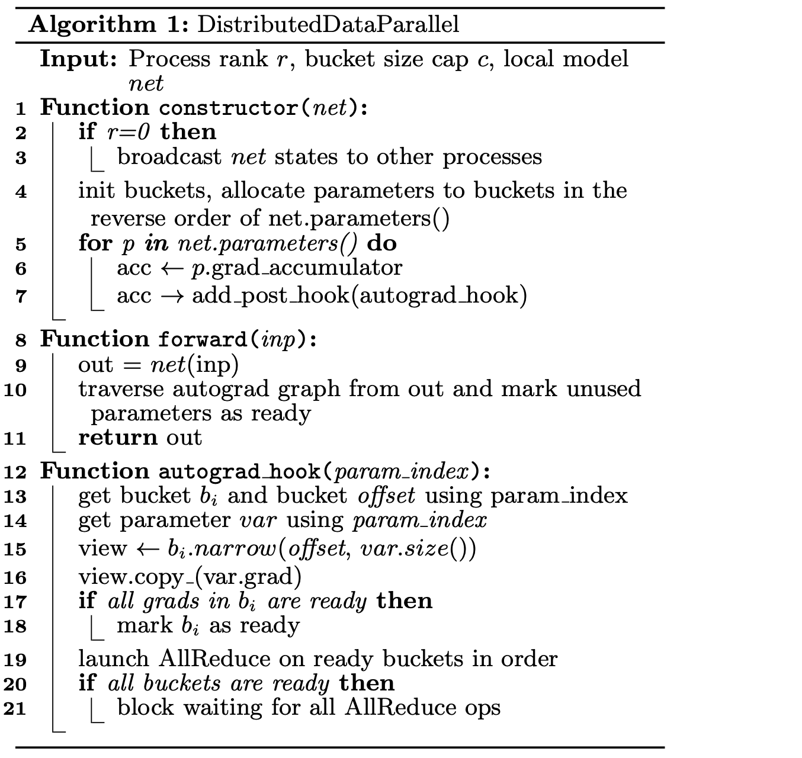
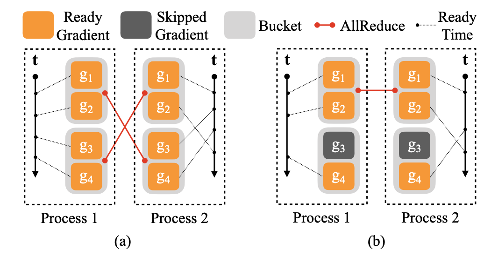
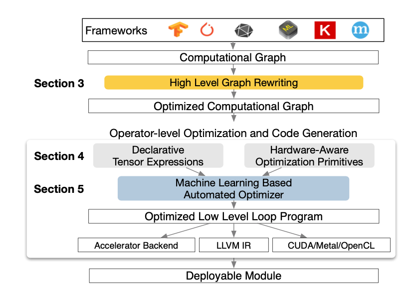
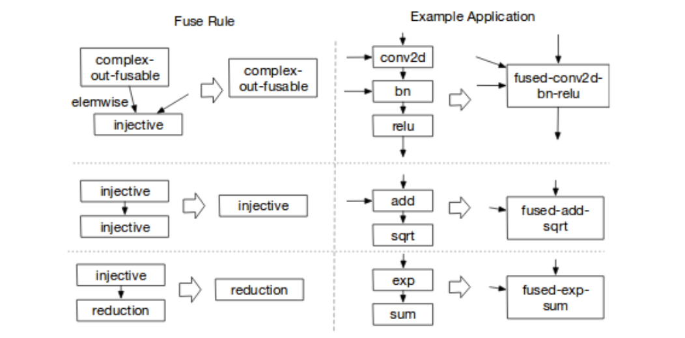
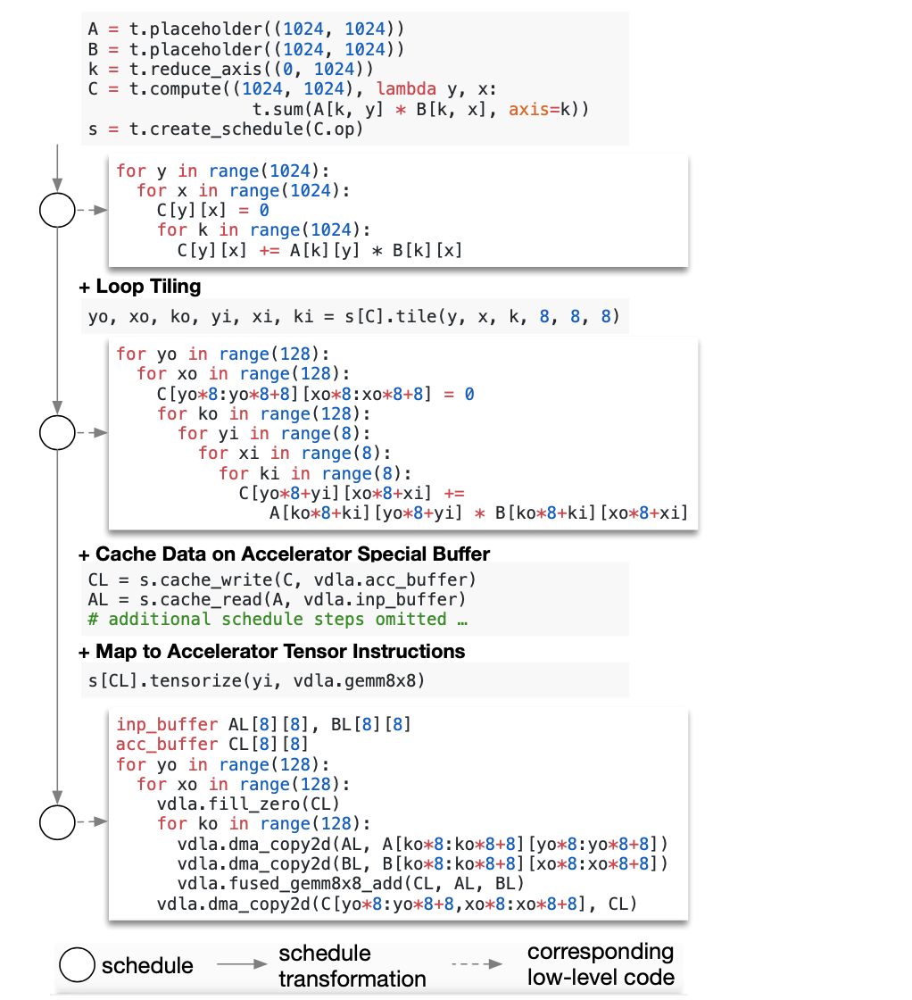

# Introduction

1. **Clipper** is a general-purpose low-latency prediction serving system. It isolates end-user applications from the variability and diversity in machine learning frameworks by providing a common prediction interface so that new machine learning frameworks and models can be introduced without modifying end-user applications. 

2. **PyTorch distributed data parallel** technology replicates the model on each computing resource to independently generate gradients, and then passes these gradients in each iteration to maintain the consistency of the model copy.

3. **TVM** is a compiler that takes a high-level specification of a deep learning program from existing frameworks and generates low-level optimized code for a diverse set of hardware back-ends. 

# Part 1 - Clipper
## Motivation

Most applications driven by machine learning depend on two stages: training and inference, but most machine learning frameworks and systems only address model training and not deployment. There is little research studying the process of inference and most machine learning frameworks provide only basic support for offline batch inference. There are three key challenges for prediction serving:
* Complexity of Deploying Machine Learning 
* Prediction Latency and Throughput 
* Model Selection 

## Approaches
### System Architecture

Clipper is divided into model selection and model abstraction layers.
* The **model abstraction layer** is responsible for providing a common prediction interface, ensuring resource isolation, and optimizing the query workload for batch oriented machine learning frameworks. 
* The **model selection layer** is responsible for dispatching queries to one or more models and combining their pre- dictions based on feedback to improve accuracy, estimate uncertainty, and provide robust predictions. 

### Model Abstraction Layer:

At the top of the model abstraction layer is the **prediction cache**. The prediction caches provides a partial pre-materialization mechanism for frequent queries and accelerates the adaptive model selection techniques by enabling efficient joins between recent predictions and feedback. 

The **batching component** sits below the prediction cache. It transforms the concurrent stream of prediction queries received by Clipper into batches that more closely match the workload assumptions made by machine learning frameworks while simultaneously amortizing RPC and system overheads. Sometimes, batching may increase the latency of predictions since it requires all queries in the batch to complete before returning a single prediction. Clipper solves this problem by employing an AIMD scheme to find the optimal batch size that maximizes throughput subject to constraint that the batch evaluation latency is under the target SLO. 

**Model containers** encapsulate the diversity of machine learning frameworks and model implementations within a uniform “narrow waist” remote prediction API.  Each model is managed in a separate Docker container, which ensure that variability in performance and stability of relatively immature state-of-the-art machine learning frameworks does not interfere with the overall availability of Clipper. In this way, resource intensive machine learning frameworks can be replicated across multiple machines or given access to specialized hardware when needed to meet serving demand. 

### Model Selection Layer:

The Model Selection Layer uses feedback to dynamically select one or more of the deployed models and combine their outputs to provide more accurate and robust predictions. The selection policy uses reward feedback to choose between and even combine multiple candidate models for a given prediction request. By selecting the optimal model or set of models to use on a per-query basis, Clipper makes machine-learning applications more robust to dynamic environments and allows applications to react in realtime to degrading or failing models. The selection policy interface is designed to support ensemble methods and explore/exploit techniques that can express a wide range of such methods.

# Part 2 - PyTorch DDP
## Motivation
Deep Neural Networks (DNN) have powered a wide spectrum of applications. Many applications pursue higher intelligence by optimizing larger models using larger datasets, craving advances in distributed training systems. Due to concise principles and wide applicability, data parallelism has become a popular solution for distributed training. Although the technology is conceptually simple, the subtle dependencies between computing and communication make it difficult to optimize the efficiency of distributed training.

## Approaches
PyTorch provides a DistributedDataParallel (DDP) module to help easily parallelize training across multiple processes and machines. During distributed training, each process has its own local model replica and local optimizer. As far as error correction is concerned, distributed data parallel training and local training must be mathematically equivalent. 

### API
When designing the API, the researchers formulated two design goals to achieve the necessary functions:
* **Non-intrusive**: The API must be non-intrusive to applications. 
* **Interceptive**: The API needs to allow the implementation to intercept various signals and trigger appropriate algorithms promptly. 

Based on the requirements above, researchers use nn.Module to achieve distributed data parallelism. It takes the local model as a constructor argument and transparently synchronizes gradients in the backward pass. 

### Gradient Reduction - A Naive Solution
DDP guarantees correctness by letting all training processes: 
* Start from the same model state 
* Consume the same gradients in every iteration. 

The first one can be achieved by broadcasting model states from one process to all others at the construction time of DDP. The second onen can be implemented by inserting a gradient synchronization phase after the local backward pass,  which means a hook can be added to trigger computation after every backward pass.

However, there are two performance concerns:
* Collective communication performs poorly on small tensors
* By separating gradient computation and synchronization, we lose the opportunity to overlap computation with communication. 

### Gradient Bucketing 
The idea of gradient bucketing is motivated by the observation that collective communications are more efficient on large tensors. Through experiment, the researchers found that instead of launching a dedicated AllReduce immediately when each gradient tensor becomes available, DDP can achieve higher throughput and lower latency if it waits for a short period of time and buckets multiple gradients into one AllReduce operation. However, DDP should not communicate all gradients in one single AllReduce, otherwise, no communication can start before the computation is over. 

### Overlap Computation with Communication 
With bucketing, DDP only needs to wait for all content in the same bucket before starting communication. Under this setting, triggering AllReduce at the end of back propagation is insufficient. Therefore, it is necessary to respond to more frequent signals and start AllReduce more quickly, which means DDP needs to register an autograd hook for each gradient accumulator.

Two things needs to concern:
* The reducing order must be the same across all processes, otherwise, AllReduce contents might mismatch, resulting in incorrect reduction result or program crash. 
* Backward pass could hang because of some gradients being skipped and never be ready to their corresponding buckets.

Algorithm 1 presents the pseudo-code of DDP

### Gradient Accumulation 
One common technique to speed up distributed data parallel training is to reduce gradient synchronization frequencies. Instead of launching AllReduce in every iteration, the application can conduct n local training iterations before synchronizing gradients globally. However, there are two problems,
* It conflicts with the gradient reduction algorithm.
* DDP cannot distinguish whether the application plans to immediately invoke optimizer.step() after backward or accumulate gradients through multiple iterations.

Additional interface (i.e., no sync) needs to be introduced for this use case. 

### Collective Communication 
DDP is built on top of collective communication libraries, including NCCL, Gloo and MPI. DPP takes APIs from the three libraries and wraps them into the **ProcessGroup** API, which expects multiple processes to work collectively as a group. As all communications are collective operations, subsequent operations on all ProcessGroup instances must match in size and type and follow the same order. Using the same ProcessGroup API for all libraries allows users to experiment with different communication algorithms with the same DDP implementation. 

# Part 3 - TVM
## Motivation
Graph-level optimizations are often too high-level to handle hardware back-end- specific operator-level transformations.  Most current DL frameworks rely on vendor-specific operator libraries and optimize for a narrow range of server-class GPUs. Operator-level optimization requires laborious manual effort and are too specialized and opaque to be ported across hardware devices. Both graph- and operator-level optimizations for diverse hardware back-ends are needed.

## Approaches
### Optimizing Computational Graphs 
Computational graphs are a common way to represent programs in DL frameworks. TVM implements many graph-level optimizations, including: 
* **operator fusion**
* **data layout transformations**
* **constant-folding**: pre-computes graph parts that can be determined statically to save execution costs.
* **static memory planning pass**: pre-allocates memory to hold each intermediate tensor.

**Operator fusion** combines multiple operators into a single kernel without saving the intermediate results in memory. 
four categories of graph operators:
* **injective** (one-to-one map, e.g. add)：Multiple injective operators can be fused into another in- jective operator. 
* **reduction** (e.g. sum)：A reduction operator can be fused with input injective operators 
* **complex-out-fusable** (e.g. conv2d) ：Can fuse element-wise map to output
* **opaque** (e.g. sort)：Cannot be fused.

**Data layout optimization** converts a computational graph into one that can use better internal data layouts for execution on the target hardware. It starts by specifying the preferred data layout for each operator given the constraints dictated by memory hierarchies. Then it performs the proper layout transformation between a producer and a consumer if their preferred data layouts do not match. Sometimes, it is not feasible to handcraft operator kernels for various operations desired for each back-end .

### Generating Tensor Operations 

TVM introduces a **tensor expression language** to support automatic code generation. Each operation is described in an index formula expression language. It supports common arithmetic and math operations and covers common DL operator patterns. The language does not specify the loop structure and many other execution details, and it provides flexibility for adding hardware-aware optimizations for various back- ends. a A schedule is used to denote a specific mapping from a tensor expression to low-level code (the idea from the decoupled compute/schedule principle of Halide). 

**Parallelism** is key to improving the efficiency of compute-intensive kernels in DL workloads. 
* **Shared-nothing nested parallelism model**: Requires a parallel schedule primitive to parallelize a data parallel task and each task can be recursively subdivided into subtasks. One working thread cannot look at the data of its sibling within the same parallel computation stage.
* **Fetch data cooperatively** (TVM used): Groups of threads can cooperatively fetch the data they all need and place it into a shared memory space. TVM supports this optimization by using a schedule primitive to achieve optimal performance. 

High arithmetic intensity in DL can be decomposed into tensor operators like matrix-matrix multiplication or 1D convolution. Therefore, adding tensor compute primitives can improve performance. TVM makes **tensorization** extensible by separating the target hardware intrinsic from the schedule with a mechanism for tensor-intrinsic declaration. It uses the same tensor expression language to declare both the behavior of each new hardware intrinsic and the lowering rule associated with it. On the other hand, tensorization decouples the schedule from specific hardware primitives, making it easy to extend TVM to support new hardware architectures. 

**Latency hiding** refers to the process of overlapping memory operations with computation to maximize utilization of memory and compute resources. It requires different strategies depending on the target hardware back-end. 
* **CPU**: Multi-threading
* **GPU**: Context switching of warps
* **TPU**:Decoupled access-execute (DAE)

### Automating Optimization 
The system needs to choose the schedule optimizations as well as schedule-specific parameters, which creates a large search space of operator implementations for each hardware back-end.  
An automated schedule optimizer is built with two main components: 
* A **schedule explorer** that proposes promising new configurations
* A machine learning **cost model** that predicts the performance of a given configuration. 

TVM use an ML model that takes the lowered loop program as input and predicts its running time on a given hardware back-end. The model is trained using runtime measurement and no need for hardware information. We update the model periodically As more configurations are explored during optimization, the model is updated periodically. There are several options for models in ML optimizer:
* **AST**: Abstract syntax tree
* **TreeRNN**: Summarizing loop’s AST
* **XGBoost**: Gradient tree boosting (higher quality and speed)

TVM use the cost model to select promising configurations on which to iteratively run real measurements. In each iteration, the **explorer** uses the ML model’s predictions to select a batch of candidates on which to run the measurements. The collected data is then used as training data to update the model. If no initial training data exists, the explorer picks random candidates to measure.  TVM chooses a parallel simulated annealing algorithm as exploration algorithm. 

# Trade-Offs

* Batching in Clipper improves throughput and utilization of physical resources such as GPUs, but it also increases the latency by requiring all queries in the batch to complete before returning a single prediction.

* In the model selection part of Clipper, the researchers use the Exp4 algorithm to estimate the ensemble weights. It increases the accuracy, but it also increases the cost of computational resources consumed by each prediction in order to evaluate all the base models.

* In Bucket Allreduce of PyTorch Dpp, packing more gradients into the same bucket would reduce the amortized system overhead of communication. However, using a large bucket size would result in longer lead time for reduction, as each bucket needs to wait for more gradients.

# Open Questions and Future Work

* As mentioned in the TVM paper, the researchers believe that the TreeRNN cost model is also valuable and expect more future research.
* Why don't we have official API like AllReduce in Apache Spark? (Saw some implementation on Github, but not official)

