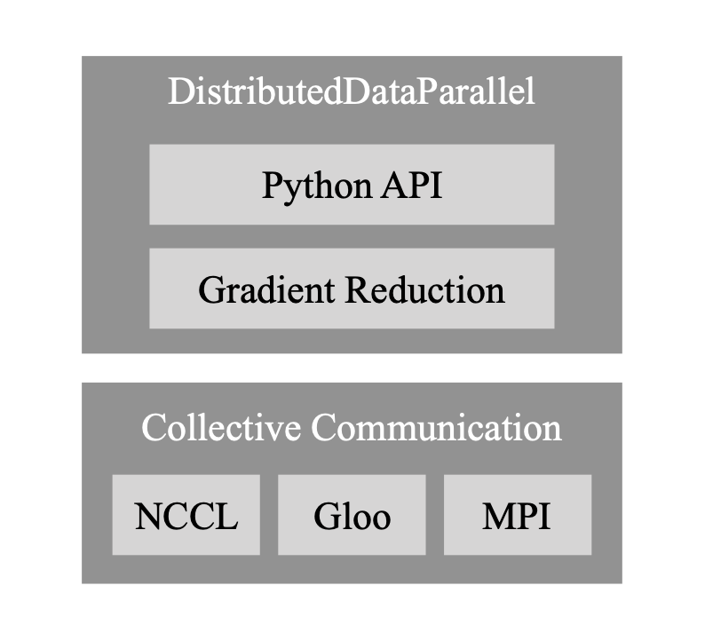
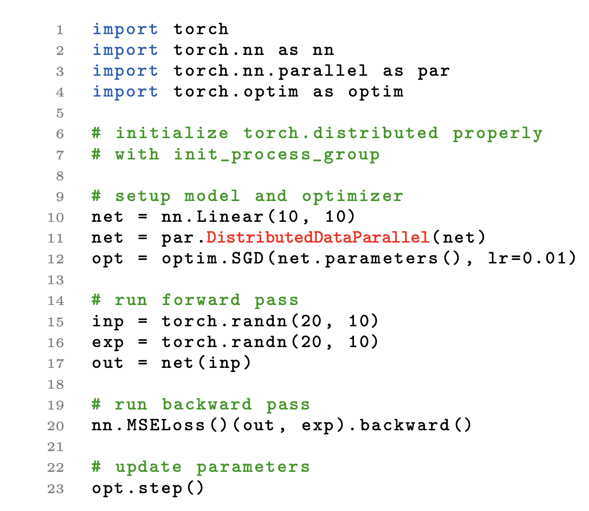
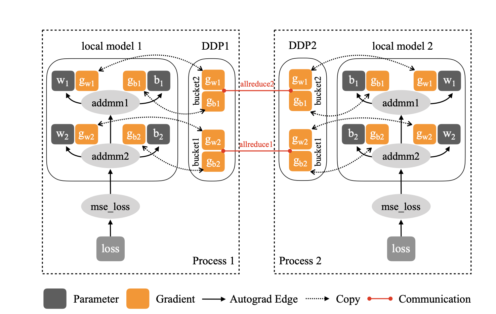
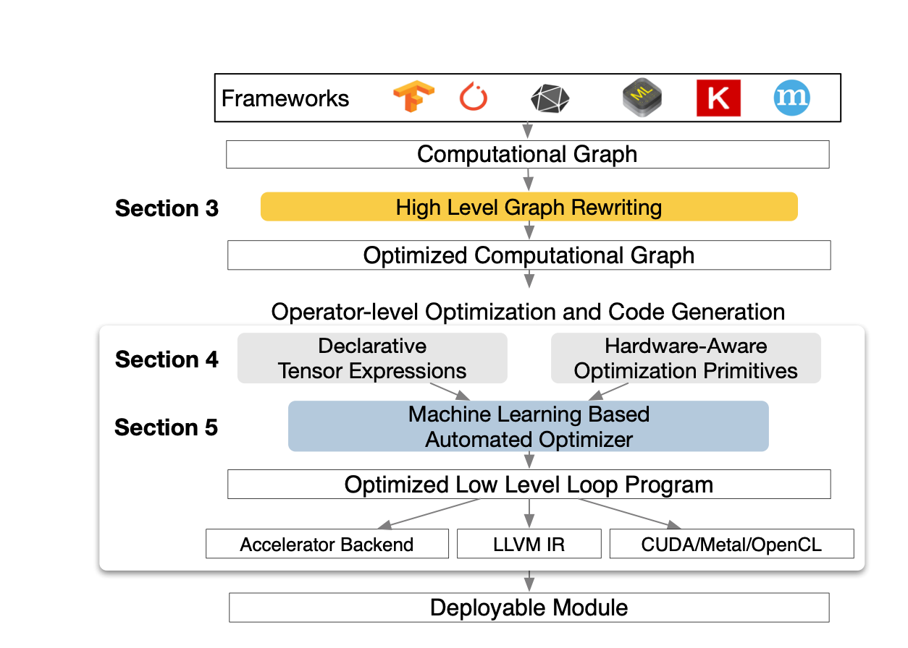
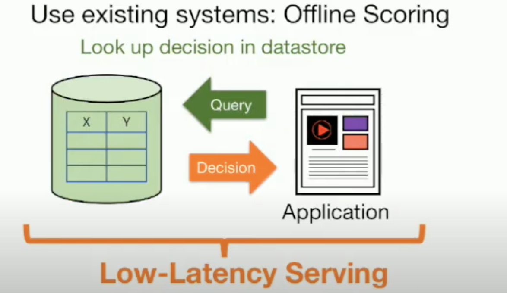
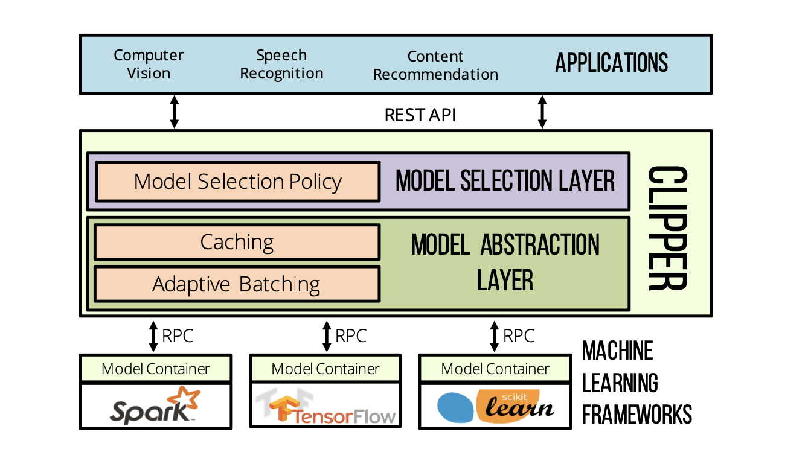

# Introduction
Those are brief introductions for this week's papers:
1. PyTorch Distributed presents the design, implementation, and evaluation of the distributed data parallel package in PyTorch v1.5
2. TVM introduces a compiler that exposes graph-level and operator-level optimizations to provide performance portability to deep learning workloads across diverse hardware back-ends
3. Clippers introduces a modular architecture to simplify model deployment across frameworks and applications.

# PyTorch Distributed
## Motivation
The development of deep learning model makes the datasets and models larger than before, which require more resources on training process. For DNN, there are three main operations: the forward pass to compute loss, the backward pass to compute gradients, and the optimizer step to update parameters.

Applications and make replicas of training data, and each of them is working on portion of the whole dataset and do forward/backward operations. As a result, the loss and gradient could be synchronized from different resources like calculating the sum average.

## Approaches

PyTorch uses DistributedDataParallel(DDP) to parallelize data and models across different machines and processors. It contains a Python API frontend, C++ gradient reduction core algorithm, and employs the c10d collective communication library as showns below:

1. Python API
Theere are two main design goals for API:
- Non-intrusive: The developer should able to make minimal change to codes when transfering from local to parallel computing.
- Interceptive: The API needs to allow the implementation to intercept various signals and trigger appropriate algorithms promptly.

Below indicates that only one line needed when we transfer local to distributed machines.

2. Gradient Reduction

- Naive solution: PyTorch autograd engine accepts custom backward hooks. DDP can register autograd hooks to trigger computation after every backward pass. When fired, each hook scans through all local model parameters, and retrieves the gradient tensor from each parameter. Then, it uses the AllReduce collective communication call to calculate the average gradients on each parameter across all processes, and writes the result back to the gradient tensor.

- Gradient Bucketing: Experients shows that the total communication time decreases when using larger input tensors. Instead of launching a dedicated AllReduce immediately when each gradient ten- sor becomes available, DDP can achieve higher throughput and lower latency if it waits for a short period of time and buckets multiple gradients into one AllReduce operation.

- Overlap Computation with Communication: 

- Gradient Accumulation: Here AllReduce is not called in each iteration. Instead, the application could do n iterations before gradient synchronizing.

3. Collective Communication: DDP is built on top of collective communication libraries, including three options, NCCL, Gloo, and MPI. DDP takes the APIs from the three libraries and wraps them into the same ProcessGroup API.

## Trade-Offs

- No single configuration could work well for every job. Developers need to make individual configurations. Sometimes it also takes time to find out the optimal solution.

## Open Questions and Future Work

- Drop out technique:

As disscussed in the paper, drop out is a popular technique to avoid overfitting and acceleration, especially in deep neural network. For local environment, it is easy to accomplish. However, during DDP it could not save time since fixed parameter-to-bucket mapping. Consequently, regardless of how the forward pass skips layers, there is always the same amount of data to be communicated across the wire during the backward pass.

- Compressoin: By compressing the gradient, the volume of data during communication could be much less.

# TVM
## Motivation

Currently there are various of hardware accelerators and we need to rebuild the entire software stack on top of it for each of them. So it't better if we could design a bridge between the user's customized framework and the hardware.

## Approaches

Below shows the whole design of TVM:

- The system take input model from framework and transform it into computational graph.
- Then it uses high-level graph rewritting to generate a optomized computational graph.
- The operator-level optimization module must generate efficient code for each fused operator in this graph: TVM produces efficient code for each operator by generating many valid implementations on each hardware back-end and choosing an optimized implementation.
- We use use an ML-based cost model to find optimized operators.
- The system packs the generated code into a deployable module.

## Open Questions and Future Work

The co-design between the software and hardware, so more future work may be based on it since we will need different accelerators for models.

# Clipper
## Motivation

There are a lot of systems designed for training models. However the systems designed for serving the application after the model has been trained, is much less. There are several challenges when we design this system:
- It need to support low-latency, high througput serving workloads.
- It need to support different ML ecosystems and frameworks.

There are existing serving system, trying to make all possible predictions and store them in to query offline. During serving, the application just look up the revelant query in database. However the application is bounded into the the pre-disigned database.

## Approaches

There are two layers in clipper: model selection layer and model abstraction layer. The model abstraction layer is responsible for providing a common prediction interface, ensuring resource isolation, and optimizing the query workload for batch oriented machine learning frameworks. The model selection layer is responsible for dispatching queries to one or more models and combining their predictions based on feedback to improve accuracy, estimate uncertainty, and provide robust predictions.

The application will send the prediction request through REST API. Based on the preeiction request and previous feedback, clipper will select one of several best models. The model abstraction layer first checks the prediction cache for the query before assigning the query to an adaptive batching queue associated with the desired model. The adaptive batching queue constructs batches of queries that are tuned for the machine learning framework and model. After that the queries will be sent to different ML frameworks in containers through RPC.

### Model Abstraction Layer

Model Abstraction Layer provides a common interface across machine learning frameworks. 
- The prediction caches provides a partial pre-materialization mechanism for frequent queries and accelerates the adaptive model selection techniques  by enabling efficient joins between recent predictions and feedback.
- The batching component sits below the prediction cache and aggregates point queries into mini-batches that are dynamically resized for each model container to maximize throughput.

### Model Selection Layer

The Model Selection Layer uses feedback to dynamically select one or more of the deployed models and combine their outputs to provide more accurate and robust predictions.

## Trade-Offs

- Clipper does not optimize the model within the frameworks.
- Clipper does not manage the training or re-training model within the frameworks.

## Open Questions and Future Work

The clipper could improve the performace of the model if out-of-date. Could we do some interaction between clipper and models to improve the accuracy?
# References:
1. https://arxiv.org/abs/2006.15704
2. https://arxiv.org/pdf/1802.04799.pdf
3. https://www.usenix.org/system/files/conference/nsdi17/nsdi17-crankshaw.pdf

