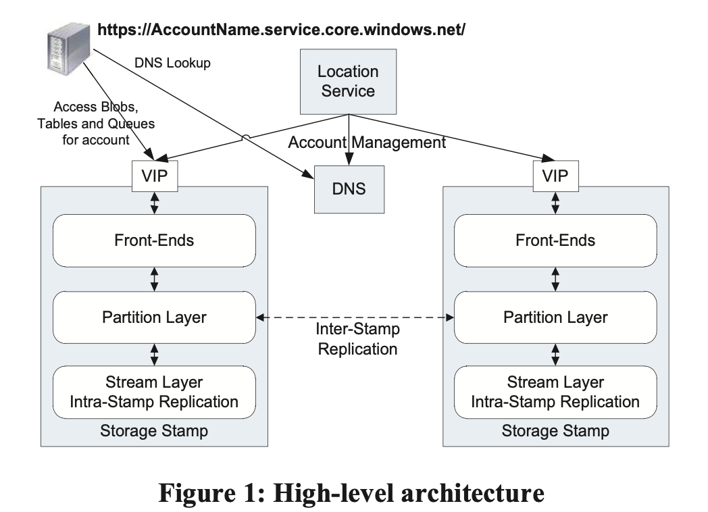
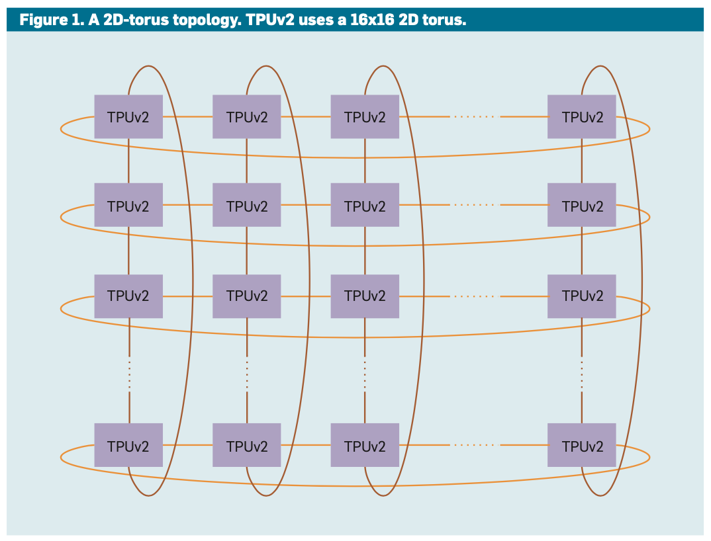
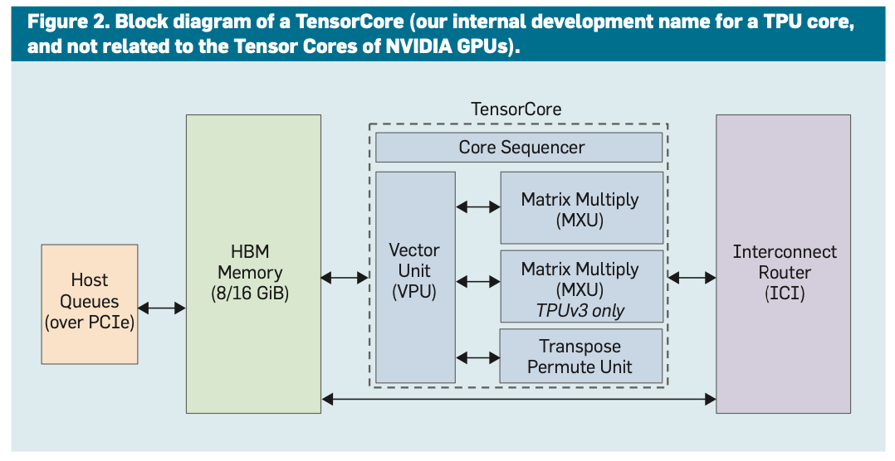
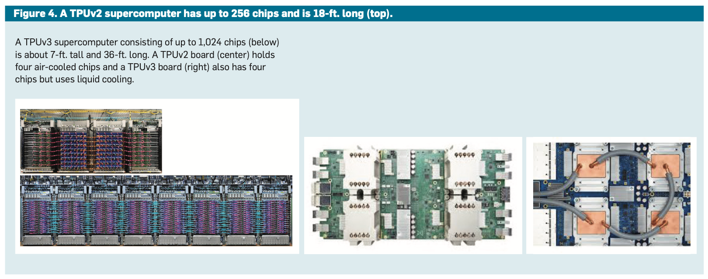
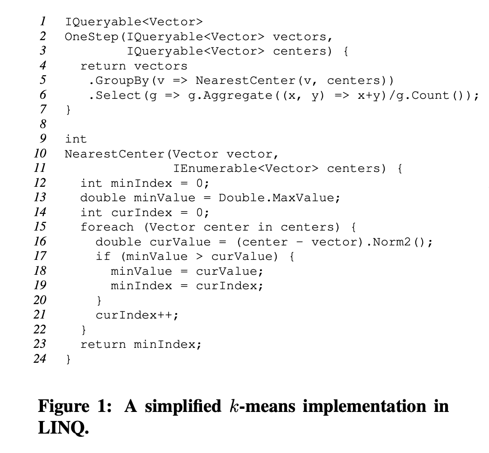
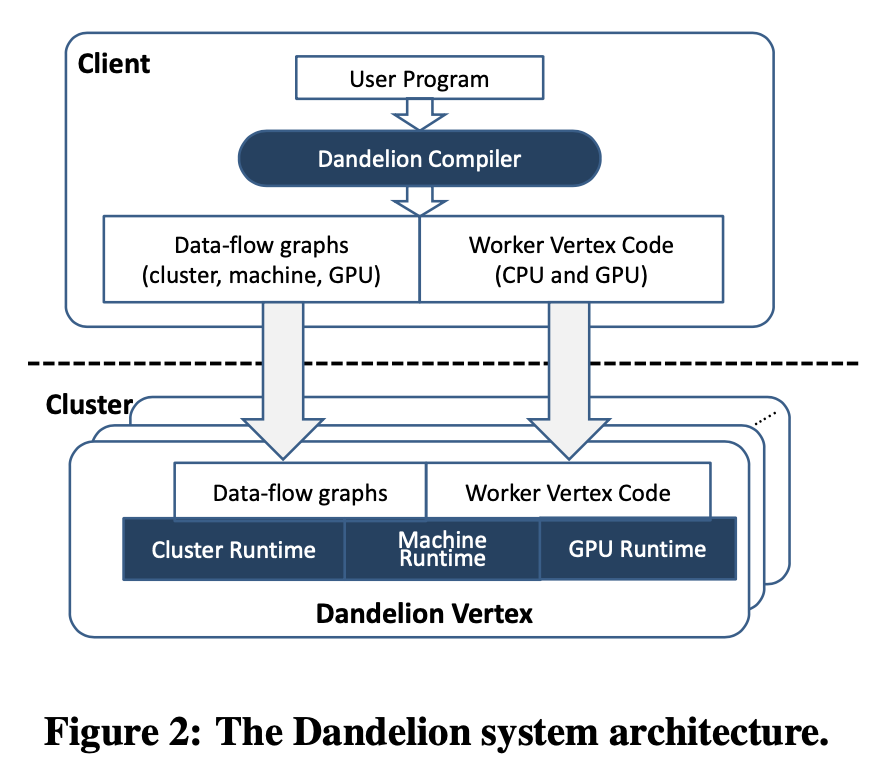
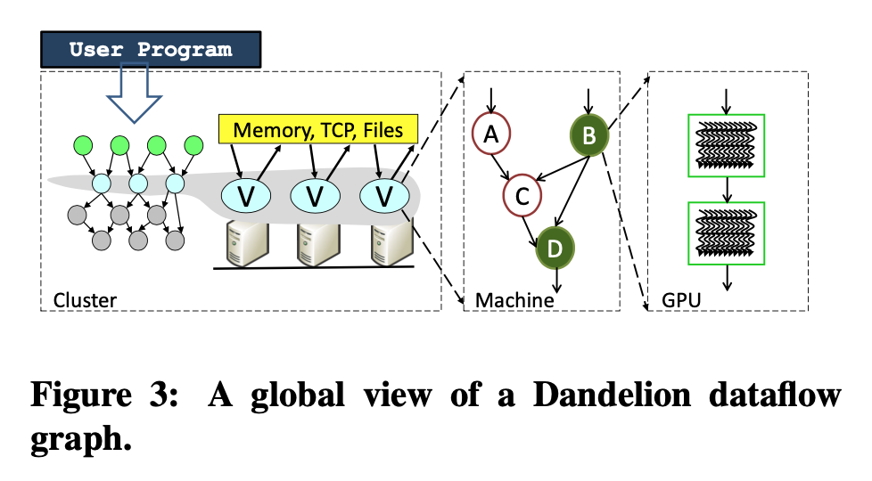

|Title | Author|
|---- | ----|
| Introduction and Trends | Rahul Vadaga <srv304@nyu.edu>|


# Introduction
The readings covered in this week include:

1. **Azure Storage** - Highly available cloud storage service with strong consistency
2. **Tensor Processing Unit (TPU)** - A domain-specific supercomputer for training deep neural networks (DNNs)
3. **MapReduce** - A compiler and runtime for heterogenous systems

# Part 1 - Azure Blob
## Motivation
Windows Azure Storage (WAS) is a cloud storage system that is being used internally in Microsoft and by 1000s of its customers. Some key design features include:

**Strong Consistency:** Many of its customers, especially enterprises, are moving their applications to cloud. Their general requirements include conditional reads, writes and deletes for concurrency control on strongly consistent data.

**Global and Scalable Namespace/Storage:** WAS's major goal is to enable massive data storage (on the scale of EBs), and being able to address this data using a global namespace.

**Disaster Recovery:** Customers' data needs to be stored across multiple data centers hundreds of miles apart from each other in order to provide data recovery protection against disasters.

**Multi-tenancy and Storage Costs:** WAS should be able to be serve multiple customers from same shared storage infrastructure. It needs to combine workloads of several customers with varying requirements together, so as to minimize storage costs.

## Approaches
### Global Partitioned Namespace
WAS provides a single global namespace to allow clients to address all of their storage. This leverages DNS as part of the storage namespace and breaks the namespace into 3 parts: account name, partition name and object name. All data is made accessible via a URI:

```http(s)://AccountName.<service>.core.windows.net/PartitionName/ObjectName```

**Account Name:** This is a customer selected account name, and it's used to locate the primary storage cluster and data center where their data is stored. An application can use multiple accounts to store its data across different locations.

**Service:** This specifies the service type. WAS provides cloud storage services in the form of _Blobs_ (user files), _Tables_ (structured storage), and _Queues_ (message delivery). A typical usage pattern seen in WAS -- shipping incoming and outgoing data via _Blobs_, using _Queues_ to provide overall workflow for processing blobs, and storing intermediate service state and final results in _Tables_ or _Blobs_.

**Partition Name:** `PartitionName` along with `AccountName` is used to locate the data within a storage cluster. It's also used to scale out data across different nodes based on traffic needs.

**Object Name:**  This identifies individual objects within that partition. For example, a row in a table, message within a queue. Sometimes, this is optional, like in the case of blobs -- a blob can be uniquely identified using `AccountName` and `PartitionName`.

### High Level Architecture
#### Windows Azure Cloud Platform
Windows Azure Cloud Platform (WAP) runs multiple cloud services across different datacenters and different geographic regions. Azure Fabric Controller is a layer that provides resource allocation, deployment/upgrade, and management of cloud services on the WAP.

WAS in one such service running on top of the Fabric Controller. WAS relies on this controller for node management, network configuration, health monitoring, starting/terminating instances, and deployment for WSC system. WAS is responsible for managing data replication and its placement across disks, loading balancing the data and application traffic within the storage cluster.

#### WAS Architectural Components
WAS is designed to support massive data storage and access. As of 2011, WAS was hosting 70 PBs of raw storage.



There are 2 main components in the WAS architecture:

**Storage Stamps:** A storage stamp is a cluster of `N` (typically 10-20) racks of storage nodes (18 per rack), with each rack being built out as a separate fault domain with redundant networking and power. WAS first gen storage stamp held ~2PB of raw storage each. Storage stamp utilization is kept around 70% in terms of capacity, transactions and BW. This is done to (1) optimize throughput and disk seek time, and (2) ensure availability and storage capacity when a rack inside a storage stamp fails.

**Location Service:** The location service (LS) manages all the storage stamps, and account namespace across all the stamps. LS allocates accounts to storage stamps, and manages them across stamps for disaster recovery and load balancing. LS application is distributed across 2 geographic locations for its own disaster recovery. When new storage workloads are created, LS chooses storage stamp based on factors such as -- location affinity (US North, etc.), fullness of stamps, network and transaction utilization.

#### Three Layers within a Storage Stamp
**Stream Layer:** This layer provides an internal interface that's used only by the partition layer. It provides a file system like namespace and API, except that writes are append-only. It understand files, how to store them, but does not understand high level object constructs or their semantics. It distributes and replicates the data across many servers to ensure availability within a storage stamp.

The stream layer allows its client (the partition layer) to open, close, delete, rename, read, append to, and concatenate large files (called as streams). A **stream** is an ordered list of extent pointers, and an extent is a sequence of append blocks. **Block** is the minimum unit of data for writing and reading. It can be upto `N` bytes (e.g., 4 MB). **Extents** are the unit of replication in the stream layer, and by default, 3 replicas are kept within a storage stamp for an extent. The target extent size used by the partition layer is 1 GB. A large object is broken into many extents by the partition layer. Every **stream** has a name in the hierarchical namespace maintained at the stream layer, and the stream looks like a big file to the partition layer.

**Partition Layer:** This layer relies on the stream layer to support high level data abstractions (_Blobs_, _Tables_ or _Queues_). Its other functions include (1) providing a scalable object namespace, (2) providing transaction ordering and strong consistency for objects, (3) storing object data on top of the stream layer, and (4) caching object data to reduce disk I/O.

Objects are broken down into disjointed ranges based on their `PartitionName`, and served by different partition servers. To achieve scalability, this layer also handles automatic load balancing of `PartitionNames` across partition servers to meet traffic needs of the objects.

The partition layer understands what a transaction means for a given object. It provides a data model for different object types, and the logic and semantics to process different objects. It also provides an important internal data structure called the **Object Table (OT)**. 3 OTs are used by the partition layer -- the _Account Table_ stores metadata and configuration for each storage account assigned to the stamp. The _Blob Table_ stores all blob objects for all accounts in the stamp. The _Entity Table_ stores all entity rows for all accounts in the stamp. The _Message Table_ stores all messages for all accounts' queues in the stamp. OTs, can grow up to several PBs, and are dynamically broken up into **RangePartitions** based on traffic load to the table and spread across Partition servers in a stamp.

**Front End (FE) Layer:** This layer consists of a set of stateless servers that handle incoming requests. Using the `AccountName` and the `PartitionName`, it routes the request to the partition server which is serving that `PartitionName`. It maintains a Partition Map that keeps track of the `PartitionName` ranges and which partition server is serving which `PartitionName`.

#### Two Replication Engines:
**Intra-Stamp Replication (stream layer):** Provides _synchronous replication_ and makes sure data written to a stamp is durable. It maintains enough replicas of the data across different nodes in different fault domains. It's handled completely by the stream layer, and is on the critical path of the customer's write request. Hence this operation should have low latency. After successful replication, status is returned back to the customer. It provides durability against hardware failures.

**Inter-Stamp Replication (partition layer):** Provides _asynchronous replication_ (it's not on the critical path of the customer's request) and is focused on replicating data across stamps. It's done in the background, and the replication happens at the object level (and hence performed by the partition layer). Its uses include (1) keeping a copy of account's data in 2 locations for disaster recovery, and (2) migrating an account's data between stamps.


## Trade-Offs
Important features of WAS include strong consistency, global partitioned namespace and geo-redundancy. These are typical requirements of enterprise customers, and hence ideal for such applications.

Other highly-available distributed storage systems put geo-replication on the critical path of the live application requests. However, there's a tradeoff between keeping them on the critical path (strong latency requirements) vs not (can be handled asynchronously in the background). In addition, performing geo-replication asynchronously allows more optimizations - batching and compaction for transferring between datacenters, and efficiently using cross-data center BW.

## Open Questions and Future Work
Some recent improvements to WAS: (1) enhancing data protection and recovery capabilities, (2) data versioning, (3) point in time restore preview, (4) allowing customers to perform a failover instead of waiting for Microsoft to do so. See these: [link1](https://azure.microsoft.com/en-us/blog/azure-blob-storage-enhancing-data-protection-and-recovery-capabilities/) and [link2](https://azure.microsoft.com/en-us/blog/azure-blob-storage-lifecycle-management-now-generally-available/).


# Part 2 - TPU
## Motivation
Recent successes of Deep Neural Nets (DNNs), along with deceleration in microprocessors development (due to slowing of Moore's Law), have lead to a resurgence in DSAs (Domain Specific Architectures) to run them. Google's TPU, is one such DSA, that attempts to improve performance on DNN workloads.

Broadly speaking, DNNs or neural networks can be defined as a graph of layers, where a layer contains a linear algebra part followed by a non-linear activation function. Network weights are initially random, and are learned during the training phase.

Stochastic Gradient Descent (SGD) is a commonly used training algorithm. An SGD step involves 3 parts -- (1) **forward propagation** (applying the inputs to the model), (2) **computing the loss** (measuring the difference between model's result and the known good result for that input) and **back-propagating** (to produce a set of error values for each layer's output), and finally (3) **weight update** (calculation of weight changes, which when added to the weights would have resulted in a near 0 loss). Each SGD step makes a tiny adjustment to the network weights that improves the model with respect to a single `(image, result)` pair. Each pass through the entire dataset is called an _epoch_, and DNNs typically take 10s to 100s of epochs to train.

Inference, on the other hand, is functionally very similar to forward propagation. Hence compared to inference, building DSAs to efficiently handle training workloads is a much harder problem.

Google's first generation Tensor Processing Unit (TPUv1) handles DNN _inference_ workloads very well, offering 50x improvement in performance per watt over conventional architectures. But that leaves another important phase viz. _training_ these networks to make accurate predictions. TPUv2 is a successor to the inference TPU (TPUv1) and this paper explores the TPU's hardware architecture and software design (mainly TPUv2).

## Approaches
Computer architects try to create designs that maximize performance on a set of benchmarks while minimizing costs, such as fabrication or operating costs. In the case of DSAs like Google's TPUs, many of the principles and experience from decades of building general-purpose CPUs change or do not apply. Here are some features that are shared between TPU v1 and v2 but do not exist in CPUs:

1. **CPU cores:** 1-2 large cores in TPUs vs 32-64 small cores in server CPUs
2. **Computational heavy lifting:** 2D 128x128 or 256x256 element systolic array of multipliers per core vs. few scalar multipliers/SIMD multipliers per core in CPUs.
3. **Data size:** Narrower data (8-16 bits) to improve efficiency of computation and memory vs. 32-64 bits in CPUs.
4. **General purpose features:** Features such as caches and branch predictors are critical for CPUs but not so relevant for DNNs.

Both training and inference share common computational elements such as matrix multiplication, convolutions and activation functions. However there are key architectural aspects where their requirements differ:

1. **Harder parallelization:** Each inference is independent, so a cluster of servers with DSA chips can scale up inference. Training, however, involves iterating over millions of examples, coordinating across parallel resources to produce single consistent set of weights for the model.
2. **More computation:** Backprop requires derivatives for every computation (weight) in the model.
3. **More memory:** Weight updates access intermediate values from forward and back propagation, vastly upping memory/storage requirements.
4. **More programmability:** Continually evolving training algorithms and models impose new demands on the design.
5. **Wider data**: Quantized arithmetics -- 8-bit ints in place of 32-bit floats -- can work for inference, but not so well when it comes to training.

### Designing a Domain Specific Supercomputer
In 2014, when the TPU project began, high performance ML was a very different landscape. State-of-the-art parallel training used asynchronous SGD, in part to tolerate tail latencies in shared clusters. Parallel training divided CPUs into a bipartite graph of workers (running SGD loop) and parameters servers (hosting weights and applying updates to them). Google took a different route -- building a DSA supercomputer instead of clustering CPU hosts with DSA chips -- for 3 reasons: (1) a single Google production application could take 2-16 months to train on a single TPU v2 chip, so it needs to be scaled to 100s of chips. (2) bigger dataset + bigger machines -> bigger breakthroughs. (3) Results like AutoML use 50x more computation to find best performing DNN models (which achieve higher accuracy scores compared to human DNN experts).

#### Designing a DSA Supercomputer Interconnect



Communication patterns in a DSA supercomputer are limited and known. For training, most traffic is all-reduce over weight updates from all nodes of the machine. Rather than distributing switch functionality into a standalone unit, TPU integrates it into each chip. TPU adopts a 2D torus topology that is optimized for the all-reduction communication pattern. To enable this torus topology, the chip has 4 custom Inter-Core Interconnect links (ICI), each running at 496 Gbps per direction in TPUv2. ICI enables direct connections between chips to form a supercomputer while using only 13% area of each chip. The TPUv2 supercomputer uses a 16x16 torus (256 chips). This ICI-based design provides higher bandwidth compare to cluster switches, while skipping the cost of Infiniband network cards, Infiniband switch and the communication delays of going through the CPU hosts of clusters. This design also enables synchronous parallel training, which offers some key benefits over asynchronous SGD.

#### Designing a DSA Supercomputer Node
The TPUv2 node of the supercomputer follows the main ideas of TPUv1: (1) A large 2D Matrix Multiply unit (MXU) using a systolic array plus large, software controlled on-chip memories instead of caches. (2) These large MXUs rely on large batch sizes to optimizes memory access for weights.



Given that training can use many processors, 2 smaller TensorCores per chip prevented the excessive latencies of a single large full-chip core. The 6 major blocks in a TensorCore are:

1. **Inter-Core Interconnect (ICI)**
2. **High Bandwidth Memory (HBM):** TPUv1 was memory bound for most of its applications, and TPU v2 was able to solve this bottleneck by using HBM DRAM. It offers 20 times the bandwidth of TPUv1.
3. **Core Sequencer:** This fetches VLIW (Very Large Instruction Word) instructions from the core's on-chip, software-managed Instruction memory, executes _scalar operations_ using a 4k 32-bit _scalar data memory_ (Smem) and 32 32-bit _scalar registers_ (Sregs), and forwards _vector instructions_ to the VPU.
4. **Vector Processing Unit (VPU):** This unit performs _vector operations_ using a large on-chip _vector memory_ (Vmem) with 32K 128x32-bit elements (16 MiB) and 32 2D _vector registers_ (Vregs) that each contain 128x8 32-bit elements (4 KiB). The VPU streams data to and from the MXU through decoupling FIFOs. The VPU collects and distributes data to Vmem using _data-level parallelism_ (2D matrix and vector functional units) and _instruction level parallelism_ (8 operations per instruction). Aside: This unit also supports batch normalization, which improves prediction accuracy and reduce time-to-train up to 14x!
5. **Matrix Multiply Unit (MXU):** This unit produces 32-bit FP products from 16-bit FP inputs that accumulate in 32 bits. The MXUs are large, but (1) their size was reduced from 256x256 in TPUv1 to 128x128, and (2) there are multiple MXUs per chip. Computation power is proportional to its area whereas bandwidth to feed & obtain results from an MXU is proportional to its perimeter. These sizes and # of MXUs have been selected by simulating convolutional model utilizations of several MXU configurations.
6. **Transpose Reduction Permute Unit:** This unit handles 128x128 matrix transposes, reductions and permutations of the VPU lanes.



#### Designing DSA Supercomputer Arithmetic
Peak performance is >= 8x higher when using 16-bit FP instead of 32-bit FP for matrix multiply, so 16-bit is highly preferred. But 16-bit operations in DNNs may not be always accurate. Some results they report:

1. Matrix multiplication outputs and internal sums must remain in fp32.
2. 5-bit exponent of fp16 matrix multiplication inputs leads to failure of computations that go outside its narrow range -- this is avoided in fp32 because of 8-bit exponent.
3. Reducing matrix multiplication input mantissa size from fp32's 23 bits to 7 bits did not hurt accuracy.

Based on these results, the authors propose a new 16-bit FP representation called the **brain floating format (BF16)**.

#### Designing a DSA Supercomputer Compiler
To program CPUs and GPUs for machine learning, TensorFlow framework is used. TensorFlow is a domain specific library built on Python. NVIDIA GPU dependent work is supported by a combination of CUDA libraries, CuBLAS and CuDNN and TensorRT system. TPU v2/v3 also uses TF, and the TPU dependent mapping is handled by the system XLA compiler (for accelerated linear algebra). A TF front-end generates code in an intermediate representation for XLA. XLA is designed to handle multi-dimensional array operations efficiently. XLA compiler also optimizes code for TPU hardware by exploiting its architectural aspects.

## Trade-Offs
1. TPUv1 handles inference workloads really well, whereas TPUv2 and TPUv3 are good at both training and inference workloads.

2. Although benchmarks suggest that TPUv3 performs similarly to the contemporary NVIDIA Volta GPU chip, parallel scaling for production applications is stronger for the TPUv3.

3. Not all DNN models can scale beyond 1000 TPUs/GPUs.

## Open Questions and Future Work
Reduced precision training can provide significant performance gains and is an active research area.

[TPUv4](https://cloud.google.com/blog/products/ai-machine-learning/google-breaks-ai-performance-records-in-mlperf-with-worlds-fastest-training-supercomputer), a successor to TPUv3, offers more than double the matrix multiplication TFLOPS of TPUv3, a significant boost in memory bandwidth, and advances in interconnect technology.


# Part 3 - Dandelion
## Motivation
The computing industry is shifting towards heterogenous systems where general purpose processors, specialized hardware such as GPUs and FPGAs, and the cloud are being combined to achieve greater performance, scalability and energy efficiency. These systems typically comprise multiple execution contexts with different programming abstractions and runtimes, hence programming them can be extremely challenging.

Dandelion tries to address this programmability issue for data-parallel applications by providing a unified programming model for heterogenous systems that spans diverse execution contexts. It automatically and transparently distributes data-parallel portions of a program to available computing resources.

## Approaches
Dandelion approaches the research problem of writing data-parallel applications for heterogenous systems. Dandelion provides a "single machine" abstraction: the programmer writes sequential code in a high level programming language such as C# or F#, and the system automatically executes it utilizing all the parallel compute resources available in the execution environment. This requires substantial work at many layers of the tech stack -- programming languages, compilers, distributed and parallel runtimes.

At the programming language level, the language integration approach has seen great success, and provides very attractive high-level program abstraction. Dandelion uses .NET LINQ (Language INtegrated Query), a programming language integration framework, as the programming model. To support a diverse set of execution contexts, Dandelion introduces a general purpose compiler framework that enables the translation of .NET byte code to multiple back-ends including GPU, FPGA and vector processors. This paper, however, discusses the design and implementation of Dandelion, limiting to distributed CPU and GPU implementation.

At the runtime level, Dandelion adopts a dataflow execution mode, where vertices of a graph represent computation and edges represent data or control communication channels. It also consists of several execution engines -- distributed cluster engine, multi-core CPU engine, and a GPU engine -- each engine representing its computation as a dataflow graph. Data transfers between engines are automatically managed by Dandelion.

### Programming Model
To support data-parallel computation, Dandelion embeds a rich set of data-parallel operators using the LINQ framework. LINQ introduces a set of declarative operators to manipulate collections of .NET objects -- set operations such as `Union`, `Intersect`; relational operators such as `Select`, `Where`  , `GroupBy`, `Aggregate` and `Join`. Programmers write LINQ queries, which are computations formed by composing these operators. Dandelion is implemented as a new execution provider that compiles these LINQ queries to run on a distributed heterogenous system.



Dandelion also extends LINQ with 3 operators:
1. `AsDandelion` - to convert a LINQ data collection into a Dandelion data collection, enabling LINQ queries to be executed by Dandelion.
2. `DoWhile` - to provide a while loop construct for iterative computations. This enables Dandelion to ship the entire conditional loop to the cluster or GPU, thus avoiding unnecessary context switching.
3. `Apply` - Applies a given function `f` on a LINQ collection. This function execution is deferred. At the cluster level, input data is partitioned across cluster machines, and the function `f` is applied to each of the partitions independently in parallel. Depending on the function `f` implementation, it runs on either CPU or GPU. Under the hood, CPU and GPU libraries such as CUBLAS and MKL are integrated into Dandelion to make their primitives accessible at the programming API.

### System Architecture


There are 2 main components in the Dandelion system are:

1. **Dandelion Compiler:** This component generates the execution plans and worker code to be run on CPUs/GPUs of cluster machines. For example, to run a k-means program on compute cluster consisting of CPUs and GPUs, the Dandelion compiler generates the CUDA code for the GPUs, and three levels of dataflow graphs -- (1) Cluster level: The compiler applies query rewrite rules to the LINQ program that transforms it into a dataflow graph. (2) In the next level, vertices of the cluster-level dataflow graph are assigned to machines, and they are expanded into a machine level dataflow graph describing the execution on that machine. (3) Finally, for vertices assigned to the GPU, a GPU-level dataflow graph is generated to describe the computation.



2. **Dandelion Runtime:** The 3 dataflow graphs shown in the above picture form the Dandelion runtime, and the composition of those graphs forms the global dataflow graph for the entire computation. The cluster execution engine assigns vertices to available machines and distributes code and graphs, and orchestrates the computation. Each machine then executes its own dataflow graph, managing input/output and execution threads. Dandelion manages machine-machine and CPU-GPU data communication automatically. The compiler generates efficient serialization code for all the data-types in both these cases. All data communication is implemented using asynchronous channels.

## Trade-Offs
1. Dandelion imposes some restrictions on programs that can be written. All the user-defined functions invoked by the LINQ operator must be side-effect free. Side effects are operations that change the global state of a computation. See [this StackExchange answer](https://softwareengineering.stackexchange.com/a/40305).
2. The Dandelion compiler depends on low-level GPU runtimes such as CUDA. These runtimes have limited support for device-side dynamic memory allocation. For this reason, the compilers do not kernelize any .NET function that contains dynamic memory execution, and executes such functions on CPUs.
3. Dandelion can improve performance using parallel-hardware, but it's performance can erode significantly due to I/O.

## Open Questions and Future Work
Dandelion runtime supports a handful of simple scheduling policies in dataflow engines, but the extent to which these policies are profitable is somewhat unknown. Some of the authors of the Dandelion paper have explored this aspect in [this work](http://sfma14.cs.washington.edu/wp-content/uploads/2013/03/sfma14-scheduling.pdf).

Dandelion adopts the .NET LINQ approach, and it tries to preserve the programming model, rather than designing new language features. Programmers could possibly find this approach/model limiting.
