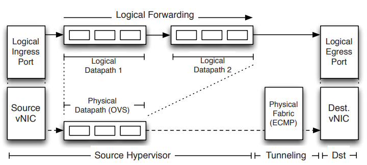
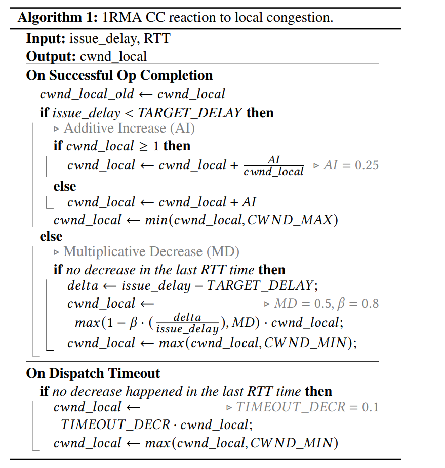

# Introduction

1. Network Virtualization in multi-tenant datacenters:
Multi-tenant datacenters represent a challenging networking 
environment. Traditional networking approaches have failed to 
meet the requirements of each customer. This provides a design and
implementation of network virtualization solution.
2. eRPC
Popular networking software designed for niche technologies such as
RDMA, FPGAs sacrificed generality to attain high performance. eRPC aims to achieve high performance networking without sacrificing
generality.
3. 1RMA
Remote Direct Memory Access(RDMA) plays a key role in supporting 
performance-hungry datacenter applications. 1RMA describes a new 
approach to remote memory access suited to constraints of multi-tenant
datacenter. 1RMA NIC is connection-free and fixed function;
treats each RMA operation independently, assisting software 
by offering fine-grained delay measurements and fast failure 
notifications.

# Motivation
Datacenters are growing at a massive scale and they have complex 
networking requirements. In case of multi-tenant datacenters,
we have to adhere to the requirements of each customer without 
compromising the generality of the networking software for ease 
of usage and maintenance. This poses a variety of challenges 
1. Network Virtualization in Multi-tenant datacenters
Customers want to connect to the cloud datacenters with minimum 
changes in their networking configuration and have specialized
requirements. Multi-tenant Network Virtualization aims to satisfy
customer requirements without operator intervention while 
preserving flexibility and efficiency.
2. eRPC
	1. High Speed datacenters
		1. Lossless fabrics for having no loss.
     		It is a link level feature to prevent congestion-based
     		packet drops. Ex: PFC(priority flow control) 
     		PFC has the following problems:  
     	 		1. Head-of-line blocking - performance-limiting 
			phenomenon that occurs when a line of packets is held up by the first
        		packet.  
     			2. Deadlocks due to cyclic buffer dependencies  
     			3. Complex switch configuration  
  		2. Large Switch buffer 
	2. Limitations of existing options
   		1. Existing mTCP slow for small messages(1.5 million vs 10 million
      		64B RPC requests/s)
	2. Recent RAMCloud has low-throughput
      		1. Inter thread communication for every requests
      		2. limit system network to 1 core
   		3. FaSST RPCs requires a lossless fabric and not handling
      		packet loss, large messages, congestion,
	3. Drawbacks of specialization
   		1. Breaks abstraction boundaries between component and increases
      		software complexity.
   		2. Co-designed systems cannot reuse existing code-bases
3. 1RMA
Existing RDMA technologies are ill-suited to multi-tenant datacenters,
where application run at massive scales, tenants require isolation and 
security, and the workload mix changes over time. 1RMA provides 
a new approach to adhere to the new requirements of multi-tenant 
datacenters. 

# Approaches and Trade-Offs

## Network Virtualization in Multi-Tenant Datacenters
### Introduction
In the past fifteen years server virtualization has become dominant
approach for managing computational infrastructures, with the 
number of virtual servers exceeding the number of physical servers
globally. Practically, deploying a new application in a development
environment requires a change in the network. 
1. Topology
Different workloads have different requirements.
Service Discovery - Flat L2,
Large analytics workloads - L3,
Some applications require multiple tiers which makes it difficult 
for a single physical topology to support the configuration
requirements. This results in multiple physical networks addressing
a common topology.
2. Address Space
VMs get an IP from subnet of first L3 router to which they are 
attached. This leads to a number of problems:
1. Operators cannot move VMs to arbitrary locations
2. Operators cannot allow  VMs run their own IP address management
   schemes.
3. Operators cannot change addressing type.
Though networking has long had a number of virtualization primitives
such as VLAN, VRFs, NAT and MPLS, virtualization of network is 
difficult as these were configured box-by-box basis. This results
in excessive operator overhead which leads to the risk of misconfiguration. This paper proposes a network virtualization platform
that has been deployed in production environment with multiple tenants
and many VMs and Virtual Networks.
### Design
MTDs have a set of hosts connects by physical networks.
Host -> Multiple VMs (via hypervisor)
VM -> Local VM/ VM in another host(via internal software switch in 
hypervisor)
1. Abstractions
- Control Abstraction
  Tenants define a set of logical network elements(or logical 
  datapaths) that they can configure similar to physical network
  elements. Though each tenant can have its own control plane, 
  network hypervisor provides the implementations for defined 
  network elements. Each logical datapath  is packet forwarding 
  pipeline interface(like ASIC) which contain a sequence of lookup
  table capable of matching over packet headers and metadata.
  Logical datapaths have more flexibility than ASIC as they are 
  virtual software switches.
- Packet Abstraction
  This enables packets sent by endpoints in the MTD 
  to be given same switching, routing and filtering services similar
  to tenant's home network. For example, tenant can define 
  the lookup table with entries matching on destination MAC addresses.
2. Architecture
   The logical datapath is implemented on the virtual switch 
   where originating VM resides.
   Logical datapath a forwarding decision -> 
   host hypervisor via physical n/w(decapsulates the packet) ->
   destination VM
   

### Trade-Offs
1. NVP relies on software switching which needs substantial
   modification for supporting high speed x86 encapsulation.
2. Difficult for high speed forwarding ASIC to inspect 
   encapsulated traffic

## 1RMA

### Design
1. Connectionless security
   Connection-free protocol that binds both encryption and  
   authentication to specific memory region being accessed
   and to accessing process/host pair.
2. Solicitation
   New requests will wait until prior operations are complete. 
3. Writes via request-to-read
   The Writer has to request to retrieve data before writing which
   helps to write failure semantics, replay protection and incast
   avoidance.
4. Explicitly-managed hardware resources
   1RMA leverages higher-level resource allocation to apportion
   its finite hardware resources according to application 
   level priority. This is to achieve simpler hardware 
   and avoid performance issues due to cache-oriented designs.
5. Fast completions with precise feedback
   1RMA imposes tight timeouts on operation completions.
   Slow Operations are converted to failures. This helps 
   to ensure that operations do not consume the solicitation
   window for an inordinate amount of time and allow applications
   to handle failures
  
1RMA congestion control objectives:
1. Enable rapid iteration on policy
2. Avoid wasted bandwidth
3. Allocate bandwidth fairly
4. Converge quickly in dynamic environments
### Trade-Offs
Long running operations might be classified as failure by 1RMA

## eRPC
eRPC is a new general-purpose remote procedure call (RPC) library that offers
performance comparable to specialized systems, while running on commodity CPUs
in traditional datacenter networks based on either lossy Ethernet or lossless 
fabrics
Objectives:
1. Fast message rate for small messages (10 million small RPCs per CPU)
2. Bandwidth for large messages (upto 75Gbps)
3. Scalability for large number of nodes and CPU cores
eRPC provides state of the art performance that works only with UDP packets
1. Handles packet loss
2. Node failures
3. Congestion control
4. Long running background request

Contributions
1. Common-case optimizations 66%
2. General eRPC can
   - Provide 2.3us median RPC latency
   - Handle upto 10 million RPCs per second with 1 core
   - T/f large msgs at 75 Gbps with 1 core
   - Maintain low switch queueing during incast
   - Perak performance with 20000 connections per node
3. Implementation of replicated in-memory key-value (Raft)
   Replication latency of 5.5us
   
Design:
1. eRPC used plain packet I/O to send messages in eRPC. 
2. Packet I/O provides completion queues that can scalably detect 
   received packets. 
3. eRPC uses zero-copy packet I/O to provide performance comparable
   to low-level interfaces.

### Trade-Offs
eRPC is most suitable for small message size which has higher latency
variance in specialized hardware.

# Open Questions and Future Work
1. Analysis of Incremental Server deployment for scalable NFV networks[1]
2. Chaining of Virtual Network functions[2]

# References
1. https://ieeexplore-ieee-org.proxy.library.nyu.edu/stamp/stamp.jsp?tp=&arnumber=9155364 
2. https://ieeexplore-ieee-org.proxy.library.nyu.edu/stamp/stamp.jsp?tp=&arnumber=6968961
 
