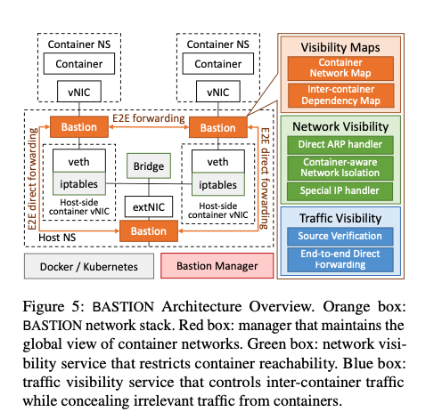
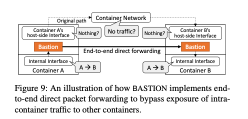
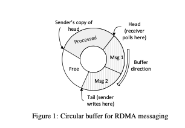

# Introduction

This week's(March 30th) papers mainly talk about improving the communication protocols within large scale distributed systems. This provides with another plane of optimization for distributed systems and help discuss areas of improvement in system design.

## Bastion:
**What is Bastion?**
* Bastion is a high-performance security enforcement stack per container. Provides an intelligent communication sandbox for containers.
* Offers isolation, performance efficiency and also a fine-grained network security policy specification. 
* It uses a decentrallized per container, per network stack. 
* Bastion security enforcement occurs before a container's packets are delivered into the container network.

## FaRM:
**What is FaRM?**
* FaRM is a main-memory based distributed computing platform that exploits RDMA to improve latency and throughput.
* It performs this speedup using techniques:
    1. Lock-free reads over RDMA
    2. Support for collating objects and function shipping which enables use of efficient single machine transactions.
* Paper also implements a hashtable on top of FaRM which achieves high space efficiency while requiring smaller number of RDMA reads for a lookup.

## Mostly Ordered Multicast:
**What is M-O-M?**
* This paper explores the benefits of co-designing along with the network with the focus example being the activity of state machine replications.
* A network level primitive called Mostly-Ordered Multicast is introduced along with a replication Protocol **Speculative Paxos**.
* **Mostly-Ordered Multicast** primitive provides a best-effort guarantee that all receivers will receive messages from different senders in a consistent order.
* **Speculative Paxos** builds on top of this primitive and is designed for an environment where re-ordering is rare.

# Motivation
## Why Bastion?

* Container based deployments has become hugely popular. Thus even a small possibility for security cracks within the container software can lead to massive difficulties and impacts of such vulnerabilities can be disastrous.
* While there exist several solutions to prevent such vulnerabilities from being exploited, eg. SELinux, AppArmor etc, none of these solutions seek to prevent the application's access to the container network. IP based access-control has limitations that could give rise to abuse by the containers.
### Limitations:

1. **Loss of container context**:
    * Each container has it's own virtual interface on the host. This virtual interface is connected to the bridge to enable connectivity.
    * However, each packet will lose it's association with the source container the moment it transitions into the host network's network. This means all decisions for routing and verification will be done based on the packet's headers.
    * This is a big vulnerability, since this data can be forged.

2. **Limitations of IP-based access control**:
    * IP addresses can be configured to be dynamic. If we specify access policies based on the IP address, this means the IP address for a container must be re-initialized whenever it respawns.
    * This is a bottleneck to both performance and security.

3. **Network Policy Explosion**:
    * Containers use IP tables to define access policies. However this IP table is centrallized and hence used for every service. Thus, an increase in the number of services corresponds to an increase in the policies present in the IP table. Larger size leads to performance degradation.

4. **Unrestricted host access**:
    * Each container network has a gateway interface for external access which is accessible to the host network. Hence a container can access services present in the host side.

5. **No Restriction on network-privileged containers**:
    * Network privileged containers can access host network interfaces, monitor traffic and can also inject malicious packets into the container network.

* Hence this necessitates a solution in a containerized environment that seeks to provide low latency along with high throughput, while minimizing the above mentioned limitations and vulnerabilities.

## Why FaRM?

* Decreasing costs of DRAM has made it cost-effective to build servers with large DRAM sizes.
* Large memory corresponds to an ability to store data for a large number of applications or atleast cache them. This leads to an enormous performance boost.
* However communication over **network** still remains as a huge bottleneck. This severely impacts scalability and performance.
* While there is a tremendous advancement in network stacks, this bottleneck will not be removed anytime until there remains a reliance on TCP/IP networking.
* This paper hence suggests an alternative approach which involves communcation over RDMA to speedup requests and helping to attain lower latencies, higher throughput and increased scalability.

## Why MOM

* Data center applications demand high performance from replicated systems.
* These systems must be able to execute operations and provide output with high throughput and low latency.
* This becomes particularly critical for applications that routinely access data from thousands of storage servers while keeping latency between fixed bounds. 
* Distributed systems are designed without any performance improvements for the underlying network. The only assumptions made expect a worst case performance from this network.
* However, modern distributed systems, for all practical purposes are designed/implemented in a data center.
* These data centers exist in secure environmments where the network is reliable, predictable and extensible.
* Hence, the need to make worst case assumptions about the network is removed.

# Approaches

## How does Bastion work?
We look at how Bastion is designed:

### Bastion Design:

Bastion employs the following design considerations:

1. Container-aware least privilege communications enforcement:
    * A container's connectivity must be a function of interdependencies between itself and the containers whose communications are required to compose a service.
2. Scalable and fine-grained network policy expression:
    * Policies must scale well to the dynamicisms and size of modern host container topologies.
3. Policy control over intra-container communications:
    * Network stack should filter out the direct access of the gateway interface.
4. Policy enforcement for network-privileged containers:
    * Fine grained access control must be possible over privileged containers.
5. Unauthorized eavesdropping and spoofing prevention:
6. Competitive performance that scales with any container topology:
    * Low latency and high throughput is desired.

Keeping in mind the above design considerations, an architecture for Bastion is proposed with the following components:

### Components

**Bastion Manager**:

* Performs 2 major duties:
1. **Container collection**:
    * Maintains 2 hashmaps - global container network map and a inter-container dependency map.
    * Periodically retrieves container information to update the map. This is done using a polling based mechanism.
    * If a pair of observed containers are not in the pre-computed inter-container dependency map, Bastion considers it to be a case of either invalid access or missing policies. It hence informs the operator to review and decide whether to produce a new network policy.

2. **Network Stack management**:
    * Installs the network stack on each newly spawned container node.
    * Known to not cause any performance drops since the overall time required to perform this activity is extremely minimal.

**Network Visibility Service**:

* Restricts connectivity among containers and between container and external hosts.
* Contains 3 major security components:

1. **Direct ARP Handler**:
    * ARP request is sent out to identify necessary network information of the target nodes. 
    * However, this also presents a vulnerability as a full ARP scan can be performed of a particular network.
    * Bastion's ARP handles this by filtering out unnecessary ARP requests that do not pertain to the present node's dependency map.
    * **DOWNSIDE**: Coverage limited to container level isolation.

2. **Inter-container communications handler**: 

* Mechanism: First the dependency b/w the 2 nodes is checked by examining the inter-container dependency map using the destination IP. If policies exist, a dependency exists. This is allowed if there exists a matching policy for the DB. Else it is dropped.

**Traffic Visibility Service**:

* Provides point to point integrity and confidentiality among container network flows. This is performed using 2 security components: 
    1. Source Verification
    2. End-to-end direct forwarding

* **Source Verification**:
    * Involves precisely tracking the source of incoming packets which signify inter-container traffic.
    * This is performed by observing the kernel metadata of the incoming packets.
    * If either the packet header information or the metadata does not match with the container network information, Bastion identifies this traffic as spoofed traffic and drops it.
    * This enables Bastion to eliminate the spectrum of disruption and spoofing threats.
* **End-to-End Direct Forwarding**: 
    * The problem this looks to solve is that the current network stacks cannot prevent the exposure of inter-container traffic from other containers. Thus, if a malicious container redirects all traffic to itself, it can easily monitor all the traffic within the system without there being any prevention. 
    * Added to this, the network privileged containers already have full visibility of all container networks and can directly monitor network traffic, without any need to even redirect it.
    * This issue is prevented by adding a forwarding component. This component performs direct packet delivery between source and destination containers, bypassing not only their original network stacks, but also bridge interfaces. 
    * This traffic isolation prevents any malicious container from eavesdropping.

## How does FaRM work ?

FaRM simply is just a platform that exploits RDMA for communication and catering to the requests. 

To understand how FaRM works, we need to understand the following optimizations and design approaches used to ensure low latency and high throughput:

### Communication Primitives:

* FaRM uses one-sided RDMA reads to access data and uses writes to implement a fast message passing primitive.
* The operations are performed on a circular buffer.
* Sender's copy of the head pointer always lags behind the receiver's head pointer, and hence sender is guaranteed to never **overwrite** unprotected messages.
* **Write Operation**: Sender uses RDMA to write messages onto the buffer tail and advances the pointer on each send operation.
* To reduce overhead, receiver updates the sender's copy only after processing atleast half of the buffer.

### Architecture and Programming model:

* Machine store data in main memory and also execute application threads. 
* Memory of all the machines is exposed as a shared address space that can be read using a one-sided RDMA.
* FaRM uses an **event driven** programming model.
* It ensures consistency by folllowing a strictly serializable ACID transactional model.
* FaRM seeks to store 2 objects in the same machine even after recovering from failures/spawning new nodes. Allows to collate data.

### Memory Management:

* Address space consists of 2GB shared memory regions. Each address unit consists of 32 bit region identifiers followed by 32 bit offset relative to the start of the region.
* To access an object, FaRM uses a form of consistent hashing to map the region identifier to machine that stores the offset.
* Memory allocation is performed in a hierarchical manner. There exist 3 levels of allocators, mainly to reduce synchronization overheads.
    1. Slab Allocators:
        * Used to allocate small objects from large blocks.
        * Each block is used to allocate objects of the same size.
        * FaRM supports 256 distinct sizes from 64 bytes to 1MB.
    2. Block Allocators:
        * Used to allocate blocks. They are present at a higher granularity than the slab allocators, and #1 allocates objects from these blocks.
        * Splits a region into blocks whose size is a multiple of 1MB.
    3. Region Allocator:
        * Existing at a cluster level, they are used to allocate memory for an entire region.
        * Uses PhyCo to allocate memory for the region followed by registering the region with the **NIC** to allow remote access.

### Transactions:

* FaRM supports distributed Transactions to ensure consistency. It follows an optimistic concurrency control protocol and performs two-phase locking to ensure serializability.
* Logs are stored and kept on SSDs. They use a few MBs of non-volatile RAM to hold the circular message buffer and to buffer the log entries.
* Uses RDMA to implement two-phase locking.
* Additionally, it provides lock-free read-only transactions. That is, the read-only transactions operate on a snapshot of the data and this enables concurrency control.
* Secondly, FaRM also provides single-machine transactions as another mechanism to achieve good performance. This is achieved by reducing the number of messages and by further reducing delay due to locks.

## How does MoM work?

* Algorithms such as Fast Paxos(and other distributed systems algorithms) in general rely on requests to arrive in order. However, given the quality and reliability of the networks present in the data centers, we can argue that they can themselves be used to order operations in a normal case.

**MODEL**:
* **Ordering Constraint**: If a node n_1 processes a multicast message 'm' followed by another message 'm2', then any other node n_2 must also process messages in the same order.
* A multicast system is said to be mostly ordered, if the ordering constraint is satisfied given a high frequency.
* However, this isn't a strict property and can hence be violated in case of transient network failures or congestions. Thus the application code must be equipped to handle such conditions.

**Design**:
* M-O-M suggests the following design options that provide a strong ordering guarantee:
    1. Toplogy aware multicast: Ensure that all messages traverse the same number of links, thereby eliminating reordering due to path dilation.
    2. High Priority Multicast: Assign high QoS priorities to the multicast messages. This eliminates drops due to congestion and reduces reordering due to queueing delays.
    3. In-Network Serialization: Routing all packets through a single root switch eliminates all non-failure related reorderings.

# Trade-Offs

## Tradeoffs observed in Bastion:
* While increasing the network policies greatly degraded throughput in the base case, using Bastion resulted in barely visible throughput degradation since the matching overhead is greatly minimized.
* In case of a single host deployment, applying Bastion's network visibility service slightly increased latency due to the newly applied security functions requiring additional packet processing to derive the reachability checks between containers. However upon applying the traffic visibility service, this overall latency improved significantly due to end-end direct forwarding.

## Tradeoffs observed in FaRM:
* Consider building a general key-value store using FaRM and another one using a distributed hash table. It is observed that FaRM provides lesser throughput on total lookup operations. This is because, read-only transactions are performed in a generic manner, without any optimizations for the application type, while a distributed hash table is far more optimized for such an operation. However, it provides far greater memory allocation and memory mapping due to it's optimized memory allocation protocol.
* For a fixed multi-get size, the benefits of batching decrease with increasing the cluster size, since the batch must be broken into a message for each machine.
* Since lookups are implemented using RDMA reads, they aren't affected and hence don't show any delays due to increased CPU utilization and queueing delays within FaRM's messaging layer.

## Tradeoffs observed in MoM:
* To minimize the disparities in message latency, a guarantee is provided that the messages corresponding to a single multicast operation traverse the same number of links. This is achieved by routing multicast messages through switches that are equidistant from all of the nodes in the target group.   This equalization of path lengths can cause an increased latency for some of the recipients since the shortest path is no longer taken.   However, this is a tradeoff worth being taken, since:
    1. The average latency is not significantly impacted.
    2. Cost of traversing an extra link is small in a data center network.

* Presence of background traffic can result in different queueing delays along different paths. This could result in a scenario where the ordering constraint is violated.   Here a tradeoff is made by assigning higher priority to MOM traffic compared to the background traffic. This greatly limits the delays and hence ensures the ordering constraint is maintained.  This also leads to negligible amounts of reordering under normal operating conditions.

# Interesting Questions and Issues:

## FaRM:
* **Issue:** Performance of RDMA operations decreased significantly as the amount of memory for remote access was increased
    * **Reason:** NIC was running out of space to cache all the page tables, resulting in it fetching page table entries from the system memory and constant thrashing.
    * **Solution:**
        1. Larger Page sizes were used to reduce the number of page table entries.
        2. Implemented a kernel driver - PhyCo, which enabled the NIC driver to use pages of size 2GB, reducing the number of total pages used.

* **Question**: How does using a location hint conform to FaRM's goal of improving latency and throughput?
* **Answer**: Hint basically specifies the address where the newer object must be allocated. Upon specifying a hint, FaRM seeks to allocate the new object either in the same block as the hint, or in the same region, or else in a region with a nearby position in the same virtual ring.   This ensures the allocated object and the hint remain collocated both on the primary and on the replicas with high probability, even after failures and reconfiguration.   This collocation conforms with FaRM's aim of providing collated objects and hence seeks to improve latency and throughput.

## MoM:
* **Question**: Detail a scenario where even path redundancy isn't able to prevent routing failures within M-O-M?
* **Answer**: Consider a scenario where there is only a single path from each root switch to a given host. This would result in a scenario where some root switches become unusable for certain replicas.  This is solved by the controller setting up rules within the network that blacklist these root switches for applicable multicast groups.

# Open Questions and Future Work

## Bastion:
Q. How well does Bastion Manager scale under high user loads?
Q. How does this system ensure Fault Tolerance, since there is only 1 centrallized Bastion Manager.
Q. How does the end-end forwarding perform under extreme congestions?

## MoM:
Q. How well does this design scale in case of a Federated cluster spread geographically?
Q. How well does this design adapt to increasing workloads where we may have to dynamically scale up the number of concerned nodes.