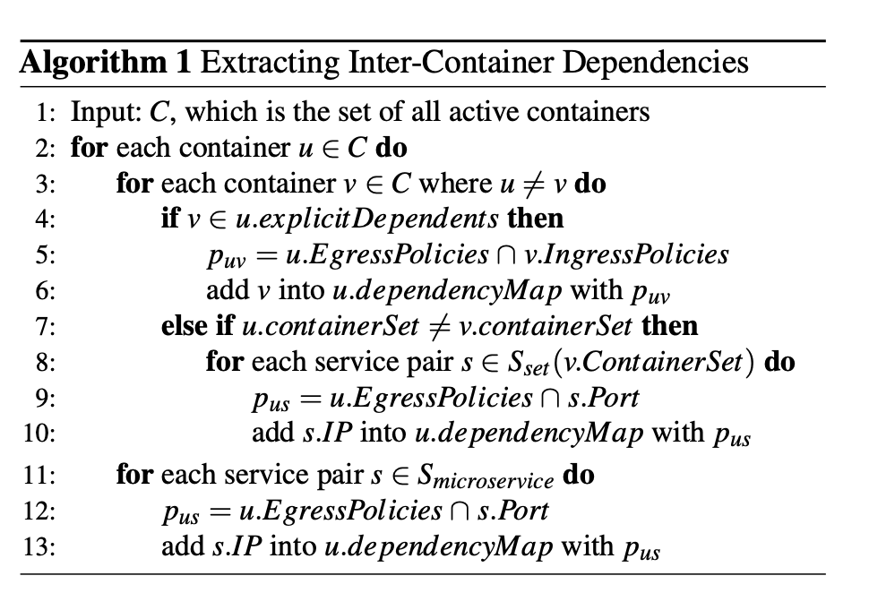

# Bastion #
# Introduction #
Large-scale instantiation of containerized applications are becoming increasingly popular. The scale at which many of these applications operate at leads to possibility of small security cracks becoming widely damaging. More specifically, this architecture places onus on the host OS to maintain isolation once a single container is infected. Various approaches to making container networks secure have been made, but few target bounding these applications' access to the container network. For each container, BASTION creates a security network, which offers isolation, performance efficiency, and a fine-grained network security policy specification that implements the least privileged network access for each container.

# Motivation #
* Current Container Networks:
  *  Docker: uses iptables.
  *  Kubernetes uses weave oberlay, where each node has a special bridge interface (weave) to connect all local containers. 
  *  Other examples: network-privileged containers -- when an operator wants to directly expose containerized services using the host IP address, they can share the host namespace with a containe, and the container is provided access to the host network interfaces, and directly exposes its services. 
  
* Problems with current security:
  1. **Loss of container context**:  As soon as it transitions into the host network namespace it is no longer clear which container produced which packet.
  2. **Limitations of IP-based access controls**: Specifying security policies for containers is is difficult because IP addresses of containers are changing. 
  3. **Network policy explosion**: As containers become more heterogenous the number of policies increase.
  4. **Unrestricted host access**: An inherent security concern arises with a container's access to a service launched at the host-side
  5. **No restriction on network-privileged containers**: Bypassing through additional network stacks (network-priveleged containers) raises concerns in regards to operational isolation. 

# Approaches #

Unlike previous network stack designs, BASTION is a decentralized, per-container, network stack -- security enforcement occurs before a container’s packets are delivered into the container network.

**Architecture:**
* **BASTION Manager**: maintains global network view of all containers, their security dependencies, and their per-container network stackes (netrwork & traffic visibility services)
* **BASTION network stack**: maintains the container's network map (network information of all reachable containers that have peer dependencies and an intercontainer dependency map) 

BASTION Architecture Overview

Continer Network Map

Algorithm For Extracting Container Interdependencies

**What Happens**:
* Using the container network map, the network visibility service can filter discovery processes of irrelevant containers by dealing with ARP requests. 
  * This happens upon a packet's arrival to the BASTION network.
* The IP handler restricts unauthorized access to special IP addresses.
* The traffic visibility service ensures secure packet-forwarding between containers by directly passing packets from source to destination container (this eliminates traffic expsure).
* inbound traffic from exteral networks use existing security mechanisms.
  
# Tradeoffs #
**Test Environment**: an experimental testbed, which used three machines to construct a Kubernetes environment with the Weave overlay network and to evaluate the BASTION prototype

* Single Host Deployment: "The base case provides latency measurements for a default configuration of two containers that interacted with no security services"
  * When applying BASTION’s network visibility service: latencies increased by 5.7% and 9.3%
    *  caused by additional packet processing for newly applied security functions.
  * When applying BASTION’s traffic visibility service: latencies improved by 26.3%
    *  their secure forwarding bypasses the existing container networks by directly fed inter-container traffic into destination containers.

* Cross-Host Deployment: Comparing to the intrahost measurements:
  *  latencies significantly increased
     *   caused by physical link traversal and tunneling overheads between hosts.

* Networking Plugins: "The base case provides latency measurements for a default configuration of two containers that interacted with no security services"
  * When applied BASTION’s network visibility service: latencies increased by 5.7% and 9.3%:
    * caused by additional packet processing required by the newly applied security functions.

# Open Questions and Future Work #

The authors mention the following issues that have not been solved:
**Container Security Analysis**

* Even with BASTION, from perspective of the filesystem, network, and memory isolation container implementations are insecure. this has been proved in: 
  * Docker Escape Attacks: allow adversaries to break out of the isolation of a Docker container by exploiting a Linux kernel vulnerability
  * Container Images: Many images on Docker Hub are outdated and vulnerability.

**Container Security and Isolation**
* Containers that have the same concerns get isolated together on top of separate library OSes. 

They also mention: Overlay network composition among hosts (nodes) are beyond the coverage of BASTION, so adding this capability could be future work.
  

# Introduction #
## FaRM ##
FaRM is a main memory distributed computing platform that exploits RDM to improve both latency and throughput. Current main memory systems that use TCP/IP perform an order of magnitude worse than FaRM. FaRM expooses the memory of machines in the cluster as a shared address space. The two performance improving mechanisms FaRM uses are:
1. lock-free reads over RDMA
2. Support for allocating objects & function shipping to enable use of efficient single machine transactions.

# Motivation #

## FaRM ##
* DRAM price drops allow commodity servers with hundreds of GBs to become cost effective. Although this enables applications to cache much larger amounts of data while removing disk/flash overhead, network communication continues to be a bottleneck. 
* The authors argue the innovative fast networks will not be enough to solve this issue as long as systems continue using TCP/IP. 
* "FaRM uses RDMA writes to implement a fast message passing primitive"
  *  that achieves an order-of-magnitude improvement in message rate and latency relative to TCP/IP on the same Ethernet network It also uses one-sided RDMA reads to achieve an addi- tional two-fold improvement for read-only operations that dominate most workloads [9, 11]"

# Approaches #
See section 3.1 of FaRM: Fast Remote Memory for below information
* FaRM uses one-sided RDMA reads to access data directly and it uses RDMA writes to implement a fast message passing primitive.The primitive uses a circular buffer (See below)
* The receiver continuously polls the word at the “Head” position to detect new messages
  * non-zero value L in the head indicates a new message, of length L.
    *  The receiver then polls the message trailer.
    *  when it becomes non-zero, the entire message has been received 
* The message is delivered to the application layer, and once it has been processed the receiver zeroes the message buffer and advances the head pointer.
* The sender uses RDMA to write messages to the buffer tail and it advances the tail pointer on every send. 
* It maintains a local copy of the receiver’s head pointer and never writes messages beyond that point.
* The receiver makes processed space available to the sender lazily by writing the current value of the head to the sender’s copy using RDMA.

# Trade-Offs #

### Evaluation summary ###
Evaluation mechanisms: 
1. compare the performance of FaRM’s key-value store with a state-of-the art implementation that uses TCP/IP. 
2. evaluate FaRM’s ability to serve a workload based on Facebook’s Tao

### Findings ###
1. state-of-the-art implementation:
   a. Pros: 
      1.  FaRM can comparatively achieve both high throughput and low latency at the same time. 
      2.  It's performance also scales well with clustersize
      3.  FaRM achieves 146 million lookups per second while providing 20 times more memory with 20 machines
   b. Cons
      1.  the baseline can achieve 40 million lookups per second, whereas FaRM achieves 26 million
          1.  caused by: general lock-free reads-- these need an extra object copy, even for local objects compared to standard lock-free reads that are specialized for this application.
2. Tao:
   1. FaRM had 10x higher throughput.
   2. FaRM had 40-50 times lower latency.

# Open Questions and Future Work #
## FaRM ##
* It is unclear how FaRM performs compared to Pilaf because its evaluation does not address scalability like FaRM.

# Mostly Ordered Multicast #

# Introduction #
Given that distributed applications today are often deployed in data centers with  more reliablea nd extensible networks, distributed systems can now be designed with their network layer. Mostly-Ordered Multicast (MOM) is introduced as "a best-effort ordering property for concurrent multicast operation." In creating it the authors have seen performance benefits up to 40% lowered latency adn 2.5x higher throughput than batching.

# Motivation #
Co-designing the distributed systems and its network layer can offer various benefits. The ability to do so lies in the fact that data center networks are:
* **More Predictable**: The structured topologies make packet routes and expected latencies more clear.
* **More Reliable** Losses can be unlikely using various features.
* **More Extensible**: enables new types of in-network processing/routing. 
  
# Approaches #
**The Design:** The following design options create progressively stronger ordering guarantees. The common thread among the below ideas is that messages can be sent along predictable paths through the data center network topology with low latency and high reliability in the common case.

1. **Topology Aware Multicast**: to eliminate reordering caused by path dilation, all multicast messages traverse the same number of links.
2. **High-priority multicast:** assign high QoS priorities to multicasts in order to eliminates drops due to congestion, and reduce reordering due to queuing delays.
3. **In-network serialization:** route all packets through a single root switch in order to eliminate all remaining non-failure related reordering.

The authors argue a data center netwrok with MOMs can be viewed as **approximately synchronous** and introduce Speculative Paxos: a new state machine replication protocol which relies on MOMs to be ordered. 
1. Replicas speculatively execute requests to minimize latency and increase throughput (avoids communication between replicas.)
2. If order violations occur, a reconciliation protocol is used to agree on new state. 

# Trade-Offs #
* "At low to medium request rates, Speculative Paxos provides lower latency (135 μs) than either Paxos (220 μs) or Fast Paxos (171 μs). This improvement can be attributed to the fewer message delays."
* "When packet reordering is rare, Speculative Paxos outperforms Paxos and Fast Paxos by a factor of 3×, as shown in Figure 9. As the reorder rate increases, Spec- ulative Paxos must perform reconciliations and perfor- mance drops. "
  * "Paxos performance is largely unaffected by reordering, and Fast Paxos through- put drops slightly because conflicts must be resolved by the leader, but this is cheaper than reconciliation"

# Open Questions and Future Work #
How can this co-designing structure better handle packet reordering and different request rates?

# Sources #
[1] [BASTION: A Security Enforcement Network
Stack for Container Networks](zhttps://cs.nyu.edu/~apanda/classes/sp21/papers/bastion.pdf)
[2] [FaRM: Fast Remote Memory](https://cs.nyu.edu/~apanda/classes/sp21/papers/farm.pdf)
[3] [Designing Distributed Systems Using
Approximate Synchrony in Data Center Networks](https://cs.nyu.edu/~apanda/classes/sp21/papers/mom.pdf)