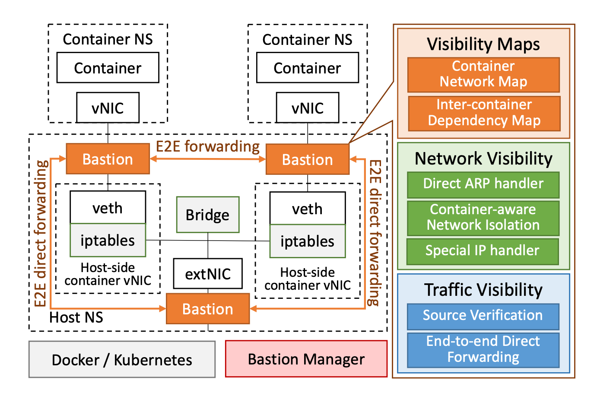
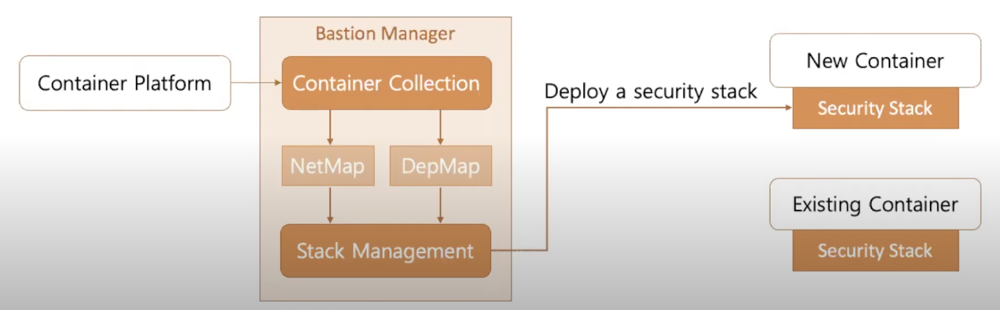
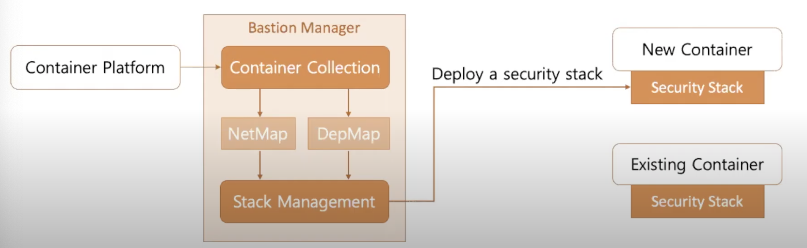

# Introduction
Those are brief introductions for this week's papers:
1. BASTION is designed to secure contain network through an intelligent contain-aware communication sandbox.
2. FaRM is a new main memory distributed computing platform that exploits RDMA to improve both latency and throughput by an order of magnitude relative to state of the art main memory systems that use TCP/IP.
3. Mostly-Ordered Multicast (MOM) is a network-level mechanisms: a best-effort ordering property for concurrent multicast operations.

# BASTION
## Motivation
Currently there are different container networks including Docker Platform, Kubernetes Orchestration System and Network-privilegesd Containers. There are some underlying architectural limitations of network security in those networks:
1. Loss of container context: We do not know where the packet actually from in the host network namespace
2. Limitation of IP-based access controls: IP address of containers can be dynamic, and adjuestment are required whenever containers are spun up and down.
3. Network policy explosion: iptables is a centralized mechanism for all network interfaces in this host, and it results in monolithic network rules, which makes the number of policies in iptables increases rapidly. This may cause performance degradation in the container ecosystem.
4. Unrestricted host access: Since the gateway of the container network is located in the host network namespace, a container can directly access thh sergive through gateway IP address.
5. No restriction on network-privileged containers: Network-privileged containers can access not only the host network interfaces, but can also monitor all network traffic from deployed containers in the host and are unrestrained in their ability to inject malicious packets into container networks.

The goal of Bastion is to:
1. Protect network threats that abuse the security challenges of current container networks
2. Isolate inter-container communications according to their dependencies

## Approaches

There are three key components in Bastion:
1. Bastion manager: Collect all network information from container platforms.
2. Network visibility service: Provide fine-grained control over different network topology visibility per container application.
3. Traffic visibility service: Securely isolate inter-container communication in a point-to-point manner and prevent the exposure of inter-container network traffic to other peer containers.

### Manager
1. Container Collection:
The manager maintains two hash maps for network and inter-container dependency. It collects the network information of deployed containers from contrainer platforms, and extract the inter-container dependencies using container from configurations and network policies.
2. Security Stack Management:
It installs the network stacks at their interfaces for new containers. The maps of security stack is updated in run time.

### Network Visibility Service

The network visibility service restricts unnecessary connectivity among containers and between containers and external hosts. Three components are introduced here to accomplish it:
1. Direct ARP handler:
BASTION’s direct ARP handler filters out any unnecessary container discovery that does not pertain to the present container’s dependency map. When a container sends an ARP request, the handler intercepts the request before it is broadcasted, verifying if the source container has a dependency on the destination container.

2. Inter-container Communications Handler:
It implements containeer-aware network isolation to address malicious access among dependent containers.
3. Gateway and ervice-IP Handler:
It filters direct host accesses to prevent a subverted container to exploit the gateway to probe services within the host OS.

### Traffic Visibility Service
The traffic visibility service provides point-to-point integrity and confidentiality among container network flows. BASTION hides irrelevant traffic from containers using two security components: source verification and end-to-end direct forwarding.

1. Source Verification: BASTION verifies the incoming traffic by comparing not only the packet header information but also its metadata to the container’s information embedded in the BASTION network stack. If either the packet header information or the metadata is not matched with the container network information, BASTION identifies the incoming traffic as spoofed and drop it.

2. End-to-end Direct Forwarding: It directly inject packets delivered from a source and bypass the container network

## Trade-Offs

- BASTION can effectively mitigate several adversarial attacks in container networks while improving the overall performance.
- It could only be applied to container network.

## Open Questions and Future Work

# FaRM
## Motivation
1. The price of hardware is getting cheaper. The decreasing price of DRAM make servers with hundreds of gigabytes of DRAM possible.
2. RDMA provides reliable user-level reads and writes of remote memory, but has not seen widespread use in data center bacause Infiniband has traditionally been expensive and not compatible with Ethernet. Now RoCE supports RDMA over Ethernet wieht data center bridging at low prices.
3. For distributed systems, the network communication remains a problem.

FaRM is built on RDMA and it improves both latency and throughput.

## Approaches

1. FaRM uses circular buffer to implement a undirectional channel. It is stored on receiver, and it is used by one send and one receiver. When a message is sent, the receiver will find the "head" to detect the messages and read the length value inside the "head". And it will use the length to locate trailer position and polls it for non-zero value, once a non-zero value is detected, the entire message has been received. Then the message will be sent to application and delete the buffer.
2. FaRM's event-based API has higher scalability than thread concurrency model. It provides strictly serializable ACID transactions mechanisms to help application maintain consistency. When performance is more of a concern, it also provides lock free read-only operations that are serializable with transactions. 
3. Objects are stored in 2GB regions distributed across cluster and Regions are located using a consistent hashing scheme.

## Trade-Offs

- It proposes a more efficient way of building distributed memory systems, which achieves an order of magnitude better throughput and latency than a similar system built on top of TCP/IP on the same physical network.
- There is a need to modify or rewrite the application since TCP/IP is no longer used and is replaced by FaRM API.
- Datacenter infrastructure need to be changed like adding NIC on each server.

## Open Questions and Future Work

It would be better if the current TCP/IP could be still used which means there is no need to write the application.

# Mostly-ordered multicast
## Motivation
Most of the distributed systems are designed independently from the network. It is suitable for Internet, since it is unpredictable. But lots of today's applications are distributed systems that deployed in data centers, and there are several properties different from Internet:
1. Data center networks are more predictable.
2. Data center networks are more reliable.
3. Data center networks are more extensible.

So now it is possible to co-design the distributed system and the network. To treat the data center as an approximation of synchronous network, two mechanisms are introduced: Mostly-Ordered Multicast and the Speculative Paxos replication protocol.

Mostly-Ordered Multicast primitive (MOM) provides a best-effort guarantee that all receivers will receive messages from different senders in a consistent order.
Building on this MOM primitive is Speculative Paxos, a new protocol for state machine replication designed for an environment where reordering is rare.

## Approaches
The traditional totaolly-ordered multicast provides the following property: if ni ∈ N processes a multicast message m followed by another multicast message m', then any other node nj ∈ N that receives m' must process m before m'.

Instead here a relaxed version is introduced: mostly-ordered multicast property is if the above ordering constraint is satisfied with high frequency. This permits occasional ordering violations: these occur if ni processes m followed by m' and either (1) nj processes m after m, or (2) nj does not
process m at all (because the message is lost). As a result, MOMs can be implemented as a best-effort network primitive.

### Design options
1. Topology-aware multicast: Ensure that all multicast messages traverse the same number of links. This eliminates reordering due to path dilation
2. High-priority multicast: Use topology-aware multicast, but also assign high QoS priorities to multicasts. This essentially eliminates drops due to congestion, and also reduces reordering due to queuing delays.
3. In-network serialization: Use high-priority multicast, but route all packets through a single root switch. This eliminates all remaining non-failure related reordering.

The common intuition behind all of our designs is that messages can be sent along predictable paths through the data center network topology with low latency and high reliability in the common case.

## Trade-Offs

## Open Questions and Future Work

# References:
1. https://cs.nyu.edu/~apanda/classes/sp21/papers/bastion.pdf
2. https://www.usenix.org/system/files/atc20-paper166-slides-nam.pdf
3. https://www.usenix.org/conference/nsdi14/technical-sessions/dragojevi%C4%87
4. https://huu.la/blog/review-of-farm-fast-remote-memory

